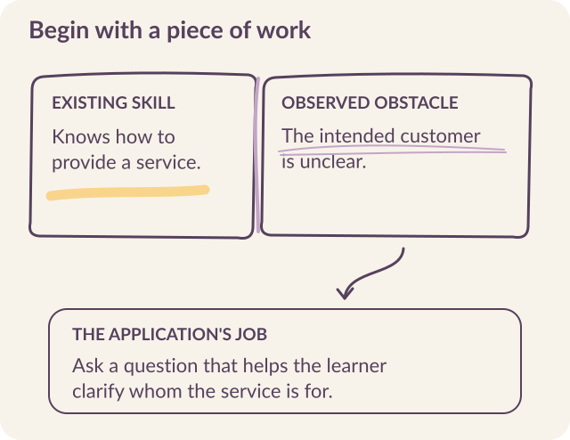

# Start with the work people already do

A tailor turning a photograph into a garment has to interpret an idea, choose materials, estimate the work, and agree on a price. Much of that judgment will never appear under the heading “knowledge work.” It is knowledge work nonetheless. The distinction matters when we decide whom to build AI applications for, and what those applications should help them do.

At Kabakoo, we work with young people developing their livelihoods in informal economies. They are learning trades, starting projects, finding customers, and drawing on knowledge acquired at home, through apprenticeships, and among peers. <mark class="reading-mark">Our starting point is that work.</mark> We ask where a person wants to go, what they already know, and what would make their next step possible.

AI can make some forms of guidance and feedback more accessible. Whether that guidance becomes useful depends on **the task, the language, the relationships around it, and the opportunity to act**. Building the application means working on those conditions together.

```{=html}
<figure id="fig-learning-pocket" class="documentary-photo">

<figcaption>A learner with the Kabakoo app on a phone and a notebook. Photograph: Kabakoo Academies.</figcaption>
</figure>
```

## Recognize the knowledge before defining the gap

Conventional employment categories conceal much of the judgment through which people create value. The shopkeeper deciding when to extend credit and the farmer deciding when to plant both work with incomplete information. Their knowledge is specific to customers, materials, seasons, and relationships. [The workers are plenty, but we are not seeing them](https://kabakoo.substack.com/p/the-workers-are-plenty-but-we-are).

An application can fail by misunderstanding that knowledge. It might give a confident recommendation based on prices the user cannot obtain, assume a supplier will extend credit, or propose an action that depends on a relationship the user does not have. Fluency makes such advice easy to read; it does not make it possible to follow.

**Begin by observing a piece of work from start to finish.** Ask the person doing it to explain a difficult decision, how they reached it, and whose advice they sought. Look at the artifacts they use: a notebook, a photograph, a voice message, a sample, a list of customers. These reveal what the application would have to understand, preserve, or make easier.

In July 2026, traders we interviewed in Lomé described irregular customers, fragile products, unavailable stock, and reluctance to publish designs that others could copy. Several businesses already used TikTok or WhatsApp to attract customers. More visibility could help one business while exposing another's designs or advertising an item already sold. [Market interviews](../sources.qmd#s28).

Before proposing an AI-generated product image or sales message, establish what is available, who controls the design, and what the seller wants to disclose. Ask whether the task is **attracting attention, communicating availability, or protecting the work**. Each calls for a different product brief.

**Livelihoods** means the ways people sustain themselves through work and economic activity. A livelihoods intervention may support a small enterprise, a trade, an apprenticeship, or access to employment. Its purpose determines what a useful result looks like. Completing a lesson is a step within that intervention; earning more reliably or gaining access to better opportunities is a further outcome to investigate.

Our ambition is **economic mobility**: people gaining greater earning power, more secure work, and more room to choose their economic path over time. Livelihoods describes the work and resources that sustain a life; economic mobility asks how that person's opportunities can expand. That is why we follow what happens beyond the course.

::: {.story-preview}
{width=220 fig-alt="Soumaïla K., Kabakoo alumnus and 3D-printing expert. Photograph: Kabakoo Academies."}

### Start with Soumaïla’s repair work

Before Kabakoo, Soumaïla studied civil engineering and repaired phones. His first Kabakoo program connected learners in Bamako with the Maryland Institute College of Art in 2019. He later repaired the electronics of a ceramic kiln at MaliBa Poterie. His existing repair skills gave him a starting point for new work. [Soumaïla’s story](../field-notes.qmd#soumaila).
:::

## Describe one obstacle that an application could address

“Young people need AI skills” gives a team very little to design.

::: {.reading-band}
A more useful brief identifies **a person, a situation, an obstacle, and a next action**.
:::

Consider a program helping learners explain a service to a prospective customer. Someone may know how to perform the work but struggle to describe the offer clearly. They could benefit from a chance to rehearse, receive specific feedback, and try again. An application might support that practice. If the obstacle is instead the cost of materials, better wording alone will not resolve it.

Suppose a learner practices describing that service, gets feedback, and tries again. This proposed exercise gives each part of the application a specific job: support an attempt, help improve it, and make the change visible.

{#fig-problem fig-alt="A service-description exercise begins with an existing skill, identifies a specific obstacle, and assigns a limited role to the application."}

A problem brief should answer four questions:

- **What is the person trying to do?** Describe an action in their working life.
- **What makes it difficult?** Distinguish what you observed from what you infer.
- **How do they manage today?** Include people, practices, and tools that already help.
- **What could change through this intervention?** Choose an outcome the program can plausibly influence.

The last question sets a boundary around the product. It also gives the team a reason to leave some work with a person, change the program, or choose a simpler tool.

## Treat relationships as part of the intervention

People often find opportunities through someone else: a referral to a customer, an introduction to a practitioner, advice about a supplier, or encouragement after an unsuccessful attempt. **Those relationships distribute access as well as information.** A learning application enters that social environment.

In Bamako, friendship circles known as *grins* are one place where conversation and information exchange happen. They helped us think about how digital learning could connect to existing forms of sociability. Investigate the relationships in the place where your program will work. Find out who people consult, whose introduction they value, and where they already learn together.

Elia Gandolfi’s June 8, 2026 analysis made the participation gap concrete. Of 826 enrolled learners, 412 had taken no qualifying action. Among the 414 who engaged, 73 had a log of an in-person visit or workshop and 341 had no such log. Those with a log sent about four times as many messages on average.

::: {.reading-note}
The groups were not randomly assigned. **The association makes in-person contact worth investigating; it does not establish its effect.** [Gandolfi’s analysis](../sources.qmd#s16).
:::

A useful product question followed: how soon should a learner meet someone who can make the experience matter? That question belongs beside decisions about models and messaging interfaces. It affects what the system must arrange and what the team must staff.

## How the youth trust survey led us toward WhatsApp {#choose-a-channel-for-a-task}

Our focus on WhatsApp grew out of the youth trust survey we conducted in Mali in 2024. The question began with a surprise at the second Bamako.ai festival that June. Influencers with a combined audience of about ten million followers generated roughly 300 registrations, while Kabakoo's own outreach brought almost 4,000. That campaign experience led us to investigate whose advice young people trusted when making decisions about training and work. [December 2024 account](../sources.qmd#s39).

The survey examined trust and influence in decisions about skills, training, employment, and entrepreneurship. Parents, teachers, and close friends ranked highest among the people respondents trusted. It also asked how young people wanted to receive information or advice from institutions with a positive influence on their decisions. **WhatsApp was the leading preferred channel: 21.5%, ahead of email at 18.1% and SMS at 16.4%.** The channel results cover **N=1,079** respondents. [Youth trust survey findings](../sources.qmd#s39).

```{=html}
<div class="evidence-bars" aria-label="Preferred channels for institutional information, Mali youth trust survey, reported December 2024">
<p class="eyebrow">HOW SHOULD AN INSTITUTION REACH YOU?</p>
<div><span>WhatsApp</span><strong>21.5%</strong><div class="bar-track"><span style="width:21.5%"></span></div></div>
<div><span>Email</span><strong>18.1%</strong><div class="bar-track"><span style="width:18.1%"></span></div></div>
<div><span>SMS</span><strong>16.4%</strong><div class="bar-track"><span style="width:16.4%"></span></div></div>
<details class="channel-comparison"><summary>Compare all eight channels</summary>
<table class="table"><caption>Preferred channels for receiving institutional information or advice · N=1,079</caption><thead><tr><th scope="col">Channel</th><th scope="col">Share</th></tr></thead><tbody>
<tr><th scope="row">WhatsApp</th><td>21.5%</td></tr><tr><th scope="row">Email</th><td>18.1%</td></tr><tr><th scope="row">SMS</th><td>16.4%</td></tr><tr><th scope="row">Phone call</th><td>13.9%</td></tr><tr><th scope="row">In person</th><td>13.5%</td></tr><tr><th scope="row">Facebook</th><td>7.7%</td></tr><tr><th scope="row">LinkedIn</th><td>5.2%</td></tr><tr><th scope="row">TikTok</th><td>3.7%</td></tr>
</tbody></table></details>
<p class="source-note">Kabakoo youth trust survey · Results published December 22, 2024. Bars show each share on a 0–100% scale.</p>
</div>
```

The result pointed toward a direct channel through which trusted relationships could carry information. The survey's separate question about trust in media for these decisions put the national broadcaster, ORTM, first. **A delivery channel and the credibility of whoever speaks through it need separate treatment.**

In December 2024, we announced a WhatsApp channel as a next step in that shift. The learning sprint launched in March 2025 then tested a further question: could structured learning take place inside the messaging environment? **The trust survey supplied the initial direction; the sprint tested whether the interaction worked.**

### Investigate how the channel fits everyday use

A later, separate 2025 survey of 336 people found frequent use of direct messaging and groups; more than half mainly relied on mobile data. In this sample, 99.1% used their own phone and 60.4% had already taken training through WhatsApp. Because this sample mostly captured people using their own phones and often already familiar with WhatsApp training, borrowed-device use and first-time participation need further investigation. [Usage survey](../sources.qmd#s29).

Another survey, of 100 people in Missabougou in November 2025, found that 71% named WhatsApp as their primary information channel, while fewer than 20% knew Kabakoo. Asked whom they trusted for training advice, 51% named family and 29% friends or grins. **Reaching a phone and earning confidence in an offer are different design problems.** An invitation may need an explanation that the learner can revisit or choose to share with someone they trust. [Missabougou survey](../sources.qmd#s29).

The move into WhatsApp also changed what people could see. In interviews comparing the Kabakoo App with WhatsApp, learners described easier portfolio submission alongside difficulty finding information in a long conversation. One valued the app's overview as a way to explain Kabakoo to friends. Channel choice therefore includes discoverability, return, and voluntary sharing of the offer. Chapter 4 examines what a migration needs to preserve. [App and WhatsApp interviews](../sources.qmd#s30).

The 2025 Activation Sprint showed how much work remained after choosing the channel. By April 1, 2,463 people had registered, but only 305 had submitted a response to the first course. Calls and operational notes identified unclear instructions, difficulty with required voice responses, inconsistent validation, and delivery failures. [Sprint record](../sources.qmd#s1).

Registration had established interest at one point in the process. It had not established that someone could use the learning service. We needed to inspect the instruction, the file that reached the phone, the response a person tried to send, and the feedback they received. Chapter 7 examines that sequence in detail.

For your own program, <mark class="reading-mark">test the channel with a complete task</mark>. A voice note may be familiar in conversation and still be an awkward format for an assignment. A short video may be clear in the office and costly to download on mobile data. Observe those differences before treating the channel choice as settled.

## Decide what AI adds

For each proposed AI function, name the practical improvement you expect. It might give feedback while a learner is ready to revise, help someone ask a question in a usable language, or retrieve the relevant course material. Then identify what the service must do when that function fails.

In the service-description exercise, an AI Mentor could ask which customer the learner wants to reach and point out an unclear sentence. A peer could explain what they understood. A practitioner could judge whether the offer fits local expectations. These contributions overlap, but they are not interchangeable. Assign them deliberately.

::: {.reading-rule}
**Compare the AI-assisted version with a feasible alternative**: a clearer instruction, a fixed example, a peer discussion, or feedback from a facilitator. This comparison keeps the product tied to a problem the organization actually needs to solve.
:::

## Put the brief on one page

Use the [problem brief](../resources.qmd#problem) to record the working situation, obstacle, existing support, proposed action, and evidence still needed. Develop it with someone who knows the community and someone who would operate the service.

A useful brief is **specific enough to be challenged**. “Learners cannot explain their offer” may turn out to describe a language barrier, uncertainty about the customer, or a poorly designed assignment. Each explanation calls for a different response. The next chapter connects that response to the wider change the program hopes to achieve.
