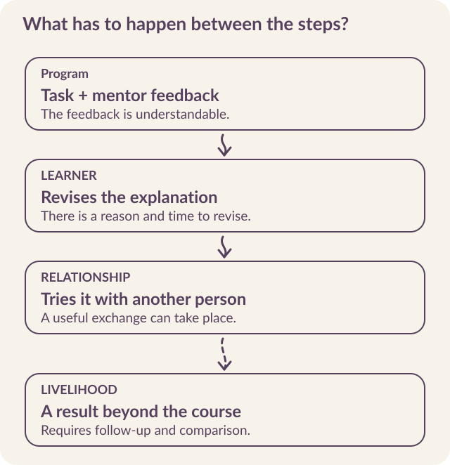

# Explain how the application could change a livelihood

An AI Mentor can reply to a question. A learner can act on the reply, discuss it with someone, revise a piece of work, or leave the conversation. **The application controls only part of that sequence.** A theory of change explains why the program expects the whole sequence to lead somewhere worthwhile.

Kabakoo's Highdigenous Connection Model places agency and social relationships within that explanation. We are building a learning system in which multilingual mentoring, peer collaboration, practical projects, and human contact reinforce one another. **Economic mobility is the longer-term ambition**: learners become better able to choose, act, work with others, and expand their economic opportunities.

::: {.reading-band}
Connect each feature to something a person might actually do.
:::

## Let local knowledge change the design

**Highdigenous** describes Kabakoo's approach to bringing high technology into a working relationship with indigenous knowledge systems. The knowledge, materials, languages, and social practices of a place help determine what we build.

In our learning system, this affects the content of projects, the use of French and Bamanankan, and the relationship between digital interaction and learning together in person. Local knowledge supplies problems worth working on and ways of recognizing a useful result. It also changes who should help design and assess the work.

**Identify a decision that changed because of what you learned locally**. Perhaps a spoken explanation was more appropriate than a written answer. Perhaps feedback needed to come from a practitioner as well as a model. Perhaps the proposed group ignored relationships through which people already exchanged help. If the inquiry changes only the interface language, much of the design work remains.

## Follow a feature through to an outcome

The service-description exercise from chapter 1 provides a small example. A learner drafts an explanation of their service. The mentor asks a clarifying question. A peer says what they understood. The learner revises the explanation and tries it in an appropriate conversation outside the course.

<mark class="reading-mark">Each step rests on an assumption.</mark> The feedback must be understandable. The learner must have time and a reason to revise. The peer must contribute something useful. An opportunity to use the explanation must exist. A good response from the model establishes only one part of that chain.

{#fig-change fig-alt="A theory-of-change map links program activities to learner actions, relationships, and livelihood outcomes, with assumptions shown between the stages."}

Write these links in ordinary language before turning them into indicators. “Learners can explain the offer more clearly” is a claim to test against actual explanations. “Learners gain useful contacts” requires evidence about the help exchanged. “Livelihoods improve” requires follow-up beyond the learning interaction.

## Five mechanisms in Kabakoo's model

The model brings together five mechanisms. They organize the program around language, relationships, action, recognition, and the connection between online and offline participation.

| Mechanism | How it enters the product | What to examine |
|---|---|---|
| Multilingual interaction | Questions and feedback in a language and format the learner can use. | Whether meaning survives the exchange and the learner can continue the task. |
| Deliberate peer formation | Introductions based on interests, projects, and proximity. | Whether members exchange useful help and choose to keep working together. |
| Collaborative action | Shared work on a problem connected to the learners' economic environment. | What the group produces, tests, and revises. |
| Visible progress | Portfolios and task records that show the work behind a milestone. | Whether another person can understand what the learner did and how it was assessed. |
| Online and offline reinforcement | Digital coordination that supports human contact and further work. | Who can participate, what the meeting contributes, and what happens afterward. |

WLS brings these mechanisms together to create opportunities for change. **Their contribution has to be examined through use**. A group created by the software may never become a source of help. A portfolio may remain unread. Those are findings about the mechanism, not merely low dashboard counts. [Program design](../sources.qmd#s5).

### Test whether the mentor supports the mechanism

In a May 22, 2026 evaluation, the mentor responded to a learner stuck on a Web3 project by offering more individual AI help. The test called for a peer or community connection. **A helpful-sounding answer had bypassed a mechanism the program wanted to support.** [Evaluation baseline](../sources.qmd#s13).

Translate the theory of change into response tests. When another person's experience would help, does the mentor offer a relevant, available route? At the product level, can the learner accept or decline it? At the user level, did useful help follow? Keep those questions separate. Mentioning a pod does not establish an introduction, and an introduction does not establish a valuable relationship.

## Make agency visible in the interaction

We use **agency** to mean people's capacity to choose, act, and shape their economic path. That is a program ambition with consequences for small product decisions.

A learner needs room to select a relevant problem, question advice, revise an answer, or contest an assessment. If the system offers a choice, each option must lead to a workable next step. If it proposes a peer match, the learner needs a way to respond to that proposal.

Relationships also shape which choices feel possible. Kabakoo's 2024 youth trust survey in Mali placed parents, teachers, and close friends highest among trusted people for decisions about learning and work. The later Missabougou survey also found family and friends among trusted sources of training advice. That can support a decision, but consulting someone and giving the program permission to contact them are separate choices. <mark class="reading-mark">Let the learner decide whom to involve and what to share.</mark> Evaluate whether the relationship helps them pursue their own goals. [2024 trust findings](../sources.qmd#s39) · [Missabougou survey](../sources.qmd#s29).

Language choice also needs to remain open. Our June 2026 analysis found learners moving between French and Bamanankan according to the topic and interaction. A language selected at registration cannot describe every future conversation. **Preserving the ability to switch** is one way the product respects how people actually express themselves. [June 2026 update](https://kabakoo.substack.com/p/kabakoo-monthly-update-062026).

Assessment can also narrow someone’s sense of what is possible. A learner told us she had stopped because the AI Mentor rejected her introduction video. The assessment left her without a next attempt she was willing to make. Feedback therefore needs to help someone recover as well as explain a decision, a problem explored in Chapter 6. [The AI worked. Did it work for the learner?](https://kabakoo.substack.com/p/the-ai-worked-did-it-work-for-the).

## Look for the relationship, then count it

Social capital concerns resources people can access through relationships. Within a learning program, that could mean useful advice, a collaboration, an introduction, or practical support. **Counting group memberships is an inadequate substitute** for understanding those exchanges.

Ask learners whom they turned to, what help they received, and whether the relationship continued. Look for ties within an existing circle and connections beyond it. A familiar peer may offer reassurance; a new practitioner may offer access to knowledge or opportunities that the circle did not contain.

Kabakoo's July 2026 pod work brought this question into the AI Mentor's behavior. If the bot answers every message immediately, it may occupy the space in which a peer would have responded. The product needs to examine **what happens between people when the AI speaks, waits, or is explicitly invited** into the conversation. [July 2026 update](https://kabakoo.substack.com/p/kabakoo-monthly-update-072026).

::: {.reading-rule}
For an initial pilot, choose a few exchanges you can investigate well. For example: a learner receives useful help from someone they did not previously know; a group revises work after discussing it; or two members continue collaborating beyond the assigned activity. These are starting points for measurement. Develop the questions and interpretation with the people whose relationships you are studying.
:::

## Match the evidence to the claim

The Agency Fund's [AI evaluation playbook](https://eval.playbook.org.ai/) distinguishes model, product, user, and impact evaluation. These levels help a team ask the right question at the right point. Model evaluation examines the response. Product evaluation examines the delivered experience. User evaluation examines changes for the person. Impact evaluation addresses the development outcome.

For the worked example, that might mean checking whether feedback identifies a real weakness, whether it reaches the learner, whether the learner can produce a clearer explanation, and whether the program contributes to a livelihood outcome over time. The design of a comparison depends on which of those claims the organization wants to make.

::: {.reading-note}
Kabakoo’s studies with the University of Paderborn examine longer-running hybrid programs. Participants were randomly assigned at intake, but some controls later entered training or encountered the program through other routes. **That exposure affects the comparison.** The studies also cover a broader intervention than the current WhatsApp system; evaluating the application requires its own defined population and outcomes. [Study design and exposure](../sources.qmd#s7).
:::

## Explore four levels through one task {#four-levels}

The Agency Fund asks at Level 1: “Does the AI system perform as intended?” That question anchors the technical work. Each following level asks for **different evidence**. Apply the [TAF framework](https://eval.playbook.org.ai/) to the service-description exercise.

```{=html}
<div class="explorer" data-deck="levels" aria-label="Four evaluation levels">
<section class="explorer-panel" data-panel="L1 · Model" id="levels-1"><h3>L1 · Model</h3><p class="explorer-question">Does the response do its job?</p><p>Review whether the mentor identifies the missing customer in a service description, uses the submitted work, and gives one feasible next step.</p><h4>Evidence to collect</h4><p>Versioned submissions, rubric scores, reviewer disagreement, language checks, latency and cost.</p><p class="takeaway">A higher response score does not establish that feedback arrived or helped someone revise.</p></section>
<section class="explorer-panel" data-panel="L2 · Product" id="levels-2"><h3>L2 · Product</h3><p class="explorer-question">Can people enter, act, and return?</p><p>Trace the invitation, submission, delivery receipt, feedback, and return. Count people who never answer alongside those who complete.</p><h4>Evidence to collect</h4><p>A defined funnel, event timestamps, device tests, delivery failures, and cohort retention.</p><p class="takeaway">Messages sent by the bot are not learner activity. Continued use does not establish learning.</p></section>
<section class="explorer-panel" data-panel="L3 · User" id="levels-3"><h3>L3 · User</h3><p class="explorer-question">What changed for the learner?</p><p>Ask the learner to explain the service again. Examine clarity, confidence, and action; contact people who stopped too.</p><h4>Evidence to collect</h4><p>Before-and-after work, interviews, assessments, and knowledge, attitudes, and practices.</p><p class="takeaway">A clearer explanation does not by itself establish an income effect. Restricting follow-up to completers misses discouragement.</p></section>
<section class="explorer-panel" data-panel="L4 · Impact" id="levels-4"><h3>L4 · Impact</h3><p class="explorer-question">Did livelihoods improve because of the intervention?</p><p>Follow economic outcomes over time and compare against a credible counterfactual. Define whether the intervention is the AI, the hybrid program, or both.</p><h4>Evidence to collect</h4><p>Longitudinal outcomes, comparison design, exposure, attrition, costs, and spillovers.</p><p class="takeaway">A learner story makes a pathway concrete; causal attribution requires a comparison design.</p></section>
</div>
```

In [our evaluation essay](https://kabakoo.substack.com/p/the-ai-worked-did-it-work-for-the), Yanick Kemayou writes: “The four-level framework is not an escalator.” Two concerns follow. A learner discouraged after one rejection can disappear from an evaluation limited to people who received enough of the intervention. A useful peer relationship can be treated only as exposure or contamination even when the relationship is part of what the program creates. **Follow people who leave, and investigate the value of the relationships themselves.**

## Write down what would change the design

A theory of change becomes useful when the team can say **what would lead it to reconsider**. If a fixed example helps learners as much as AI feedback on the agreed task, the additional AI function needs another justification. If a sophisticated matching method creates no more useful collaboration than a simpler grouping method, revisit the matching method. If people already close to the organization are the only ones participating, investigate the recruitment and support arrangements.

Record the activity, the expected learner action, the longer-term outcome, the assumption connecting them, and a plausible alternative explanation. Add the evidence needed to distinguish those explanations. The [theory-of-change worksheet](../resources.qmd#change) provides a place to do that work.

Bring this model into the next research round. The purpose of user research is partly to discover where your explanation of change does not yet fit the lives of the people who would use the service.
