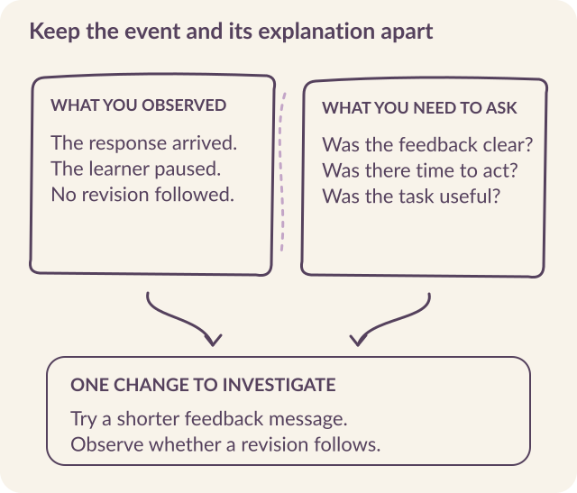

# Find out whether people can use it

The first research session should give you something more revealing than a favorable opinion about the idea. **Put a realistic task in front of someone, let them attempt it, and examine what happens.** A person can welcome the offer of training and still be unable to open the first file, understand the request, or recognize a useful next step.

At Kabakoo, research repeatedly changed the product after the channel choice seemed obvious. WhatsApp was familiar. Learning through WhatsApp introduced unfamiliar instructions, assessment, and relationships. We had to investigate those conditions separately.

A research round should end with a decision: **proceed with a defined pilot, change part of the experience, or resolve a specific obstacle first**.

## Observe the task before explaining it

Use the service-description exercise introduced in chapter 1. Give a participant the invitation and instruction they would actually receive. Ask them to try it on a device and connection representative of their ordinary use. <mark class="reading-mark">Watch what they do before demonstrating the intended route.</mark>

::: {.reading-band}
**A facilitator who explains every button can make a broken flow appear usable.**
:::

When you need to help, help; record where and why. That intervention is evidence about the support the service may need to provide.

Then ask the participant to explain what they thought the message meant, what they expected after sending their work, and whether the feedback gave them a next step. Keep their account alongside the observed sequence. A pause could reflect uncertainty, an interruption, a data problem, or a decision that the activity was not worthwhile. The screen alone cannot distinguish them.

{#fig-research fig-alt="The observation sheet separates a delivered response, a pause, and an absent revision from questions about clarity, time, and usefulness. Both inform the next change to investigate."}

## Recruit across the differences that could change use

Include people with different relationships to your organization. Someone who already knows a facilitator may interpret a short message very differently from someone encountering the program for the first time. Kabakoo's June 2026 cohort analysis found prior connection among the differences between highly active and less active learners. Recruitment source therefore became part of the product question. [June 2026 update](https://kabakoo.substack.com/p/kabakoo-monthly-update-062026).

Language, device capability, connectivity, and familiarity with the task may also change the experience. Choose participants to investigate those differences. Record who was invited, who participated, and **which circumstances the round did not cover**.

A small discovery round is well suited to finding and understanding failures. Its size should reflect the variation you need to examine and the team's capacity to observe carefully. Use a different design if the question requires a population estimate or a comparison of effects.

Kabakoo's 336-person WhatsApp survey illustrates a sampling limit: nearly all respondents used their own phone, and a majority had taken WhatsApp training before. A team relying only on those respondents could miss the conditions faced by someone borrowing a phone or encountering this format for the first time. Add those circumstances deliberately when they belong to the intended population. [Survey](../sources.qmd#s29).

## Count the people who never begin

> “Half of enrolled learners never took any action.”
>
> — Elia Gandolfi, *Phase One: Learner Engagement*, June 8, 2026. [Source and definitions](../sources.qmd#s16).

That finding concerns 412 of 826 enrolled learners. The weekly analysis then uses the **414 who engaged** as its denominator: 84% were active in week zero and 29% in week one. **Receiving a mentor message does not count as activity.** An activity chart restricted to people who already acted answers a different question from an enrollment-wide participation chart.

::: {.reading-note}
Gandolfi also found that 41 people, approximately the top tenth of engaged learners, generated 63% of the **weighted activity score**. The weights were messages × 1, videos × 3, tasks × 5, visits × 2, and workshops × 2. This is a measure of concentration under those weights, not the share of all learning or livelihood gains.
:::

For your research round, **recruit from the people who never started as well as the people who stayed**. Ask what reached the phone and what happened next. Otherwise, the people most visible in the logs can become the only people whose experience shapes the product.

## Test your explanation against people who left {#attendance-investigation}

An August 2025 investigation into falling attendance in the OSC digital cohort began with several team hypotheses: a discouraging session about participation rules, long course videos, and workshops running late. Researchers called 80 people who had never attended or had stopped; 69 were reached. They separately interviewed nine continuing participants in person. [Attendance investigation](../sources.qmd#s31).

The accounts changed the emphasis. Work and school schedules, travel, connection problems, lost links, and uncertainty about catching up appeared alongside objections to program rules. Some people reported attending online without knowing they needed to scan a QR code. A missing attendance record could therefore represent <mark class="reading-mark">a recording failure as well as an absence</mark>.

Investigate three possible explanations for the drop in attendance.

```{=html}
<div class="explorer" data-deck="attendance" aria-label="Investigating falling attendance">
<section class="explorer-panel" data-panel="Team hypothesis" id="attendance-1"><h3>The session discouraged people</h3><p>The team suspected that a session about participation rules had contributed to the fall in attendance.</p><h4>What to ask next</h4><p>Ask people to describe when they stopped and what happened then, before suggesting the team's explanation. Include people who never attended that session.</p><p class="takeaway">A plausible explanation still needs evidence that can challenge it.</p></section>
<section class="explorer-panel" data-panel="Attendance record" id="attendance-2"><h3>The log shows no attendance</h3><p>Some interviewees described joining online without knowing that scanning a QR code was part of recording attendance.</p><h4>What to check next</h4><p>Reconstruct how an attendance event is created. Compare the account with session records and the instruction shown to remote participants.</p><p class="takeaway">Check how the measurement is made before interpreting a missing event.</p></section>
<section class="explorer-panel" data-panel="Learner account" id="attendance-3"><h3>Returning feels difficult</h3><p>Calls surfaced competing responsibilities, lost links, and concern about catching up after an absence.</p><h4>What to test next</h4><p>Offer a clear return point and realistic schedule information, then investigate whether those changes resolve the reported obstacle.</p><p class="takeaway">The eleven people not reached remain unknown. Their absence from the interviews is not an explanation for leaving.</p></section>
</div>
```

## Investigate eight conditions for a pilot

Assign each research question to someone who can interpret the findings and change the product.

| Condition | What to investigate | What the answer changes |
|---|---|---|
| A worthwhile task | What is the person trying to achieve, and where do they need help? | The purpose and scope of the intervention. |
| A usable channel | Can the complete interaction work with the person's device, data, and available time? | Delivery channel, media, and response formats. |
| A credible offer | Who is sending the message, and why would the person act on it? | Outreach, explanation, referrals, and human contact. |
| A first action | Can the person understand, attempt, and submit the task? | Instruction, sequencing, and feedback. |
| A reason to return | What would make a second action useful? | Reminders, task progression, and support. |
| A place for peers | Where could another person contribute, and who can participate? | Introductions, group formation, and meeting arrangements. |
| An operating team | Who will handle confusion, disputes, moderation, and broken flows? | Staffing and the feasible pilot size. |
| A feasible service | Do delivery, data handling, permissions, opt-out, and escalation work? | The conditions that must be met before launch. |

Several conditions may fail together. A person might distrust an unfamiliar sender and also be unable to play the video. Keep enough detail to decide which change you are testing next.

## Learn from a treatment that did not arrive

Kabakoo tested testimonial videos as part of an onboarding experience. Early results were affected by Android playback failures. After the encoding problem was corrected, a follow-up comparison did not reproduce a clear completion advantage. Qualitative research also suggested that a persuasive video could prompt someone to consult others before acting. [Testimonial experiment notes](../sources.qmd#s4).

The research had to separate **the intended experience from the delivered experience**. A video designed to build trust cannot test that mechanism cleanly if part of the audience cannot watch it. A delayed response after viewing may also have a different meaning from rejection of the offer.

::: {.reading-rule}
Before comparing two messages, demonstrate that both arrive in usable form. After comparing them, ask what participants actually experienced. Product logs and conversations answer different parts of the question.
:::

## Decide what a reminder is supposed to change

In Kabakoo’s July 2026 reminder-channel results, 271 participants were assigned to WhatsApp or app push notifications. Assignment to WhatsApp increased activation, defined as at least two app logins, by 15.6 percentage points; the 95% confidence interval ran from 4.8 to 26.4 points. The estimate for total time spent was much less precise: +33%, with an interval from −37% to +184%. [Experiment record](../sources.qmd#s3).

The result supports a claim about that activation measure. It leaves considerable uncertainty about time spent. For a new pilot, **define the action you want a reminder to support before choosing the measure**. Returning to the app, submitting work, and applying feedback are different behaviors.

A reminder should also correspond to an action that is still relevant. If someone stopped because the task was unclear, another copy of the same instruction may repeat the problem. Investigate the break before increasing the frequency of contact.

## Test human support as part of the experience

A pilot needs people who can answer a confusing question, review a disputed assessment, help a group, or recover a failed interaction. Name those people and establish when they are available. Then **test whether a learner can actually reach them** through the advertised route.

Timing matters. Kabakoo's earlier cohort design placed matching after a preparatory period; later findings led the team toward earlier human contact. Waiting for signs of readiness could also postpone the connection that would help someone participate. An introduction, entry into a project group, and commitment to shared work need not happen at the same moment. Chapter 4 develops this distinction.

Staff workload is part of feasibility. During the research round, **record which cases require intervention and how long they take**. This gives the team a basis for the next pilot's scope. If an observer keeps an automation running through manual repairs, include that work in the staffing estimate.

## Make one change you can learn from

After a session, bring the learning designer, engineer, and community colleague together around the same evidence. Identify the event, the participant's account, and the explanation you want to test.

For the service-description exercise, a participant might successfully send a response yet be unable to explain what the mentor wants revised. The next change could be a shorter feedback message containing one specific question. Preserve the original and revised versions, then examine whether later participants can act on the new feedback.

Avoid changing the instruction, model, media format, and recruitment route all at once if you need to understand why the result changed. When a wider redesign is necessary, record it as such and **treat the new flow as a new version**.

## Close the round with a decision

Use the [readiness register](../resources.qmd#readiness) to give each issue an owner, supporting observation, next test, and decision. An issue can be ready for the specified pilot, require further investigation, or block that pilot.

Make the decision concrete. “Audio is unreliable” is an observation to investigate. “Run the first pilot with text responses while the speech team resolves the observed transcription failures” defines a scope the team can operate, provided text remains appropriate for the learners and task.

A launch decision should state **whom the pilot serves, what it will test, what support it requires, and who can pause it**. Readiness means being able to run that particular test and respond to the failures it reveals. Keep the next decision tied to what that pilot can establish.
