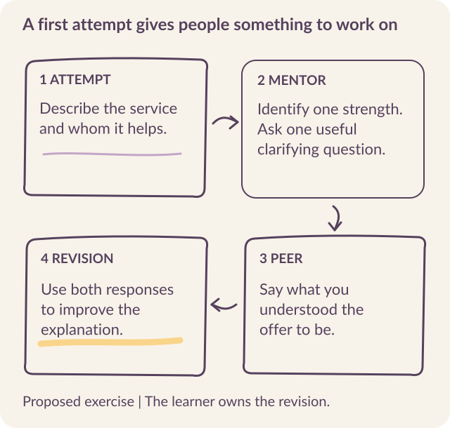
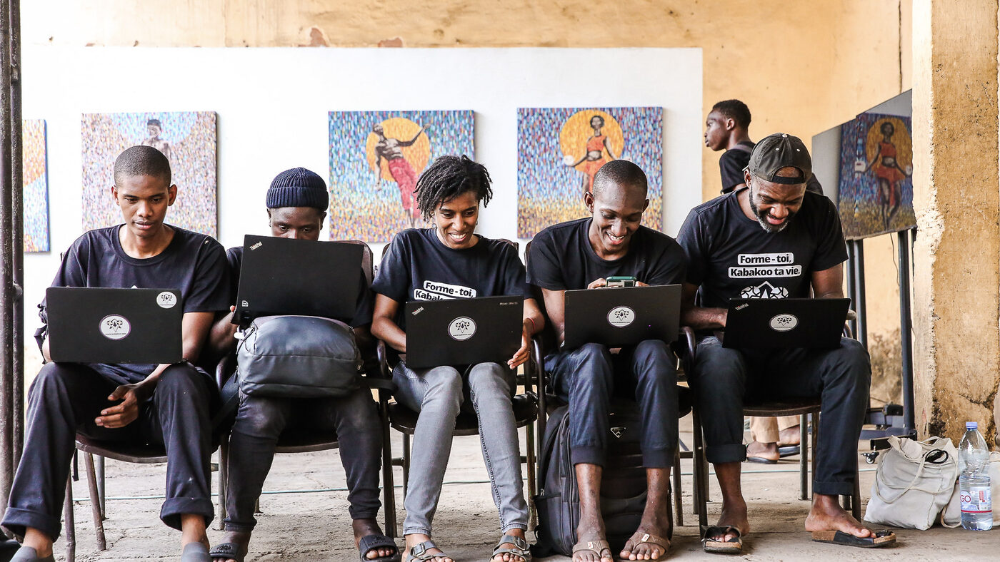

# Build a learning sequence people can complete

A learner sends a first attempt. The system acknowledges it, the mentor responds, and a new message appears. What should happen next? Until a team can **answer that question from the learner's side**, it has not finished designing the task.

Kabakoo's WhatsApp Learning System combines individual work, AI feedback, portfolios, peer pods, and contact in person. The learning design gives those components a purpose. It specifies what someone will do, what help they can obtain, and how one action prepares them for another.

## Begin with something the learner will produce

A video is an input to learning. To design the activity, **specify what the learner will do with it**: describe an experience, observe a problem, make a proposal, test an idea, or revise a piece of work. Then decide what evidence of that action the program needs.

In the service-description exercise, the learner writes or records a short explanation of a service they could offer. The purpose is to make the offer understandable to someone else. The submission gives the mentor and a peer something specific to respond to.

A useful instruction would identify the listener and the content required: what the service is, whom it is for, and what problem it addresses. It would also explain the accepted response formats. Requirements about video, length, or presentation should serve the learning objective; each adds effort that the design must justify.

## Design the response to the first attempt

Feedback needs to identify <mark class="reading-mark">what the learner can do next</mark>. “Incomplete” may be an accurate classification and still be insufficient guidance. A useful response connects the decision to a specific part of the submission.

For the service-description exercise, the mentor might recognize that the learner has explained the activity but left the intended customer unclear. It could then ask one question about that customer. The peer's role could be to say, in their own words, what they understood the offer to be. The learner uses both responses to revise the explanation.

In this exercise, the mentor helps examine the submission, the peer supplies another person's interpretation, and the learner decides how to improve it.

{#fig-sequence fig-alt="A storyboard follows a proposed service-description task through an attempt, a clarifying question, peer interpretation, and revision."}

::: {.reading-band}
**Design the acknowledgment separately from the assessment.**
:::

“Your response arrived” reports receipt. “Your work meets the criteria” reports a judgment. If processing takes time, a receipt message helps the learner know what is happening without promising a result that has not been established.

### Make the next action part of the acceptance criteria

On July 2, 2026, testers found gaps at opposite ends of a core-module task. One video arrived without explaining what to do, how to respond, or how the work would be assessed. Another flow confirmed successful validation but supplied neither a next-video action nor a route back to the menu. [Task-transition failures](../sources.qmd#s32).

**Test the whole transition**, including the instruction or next action that gives the technical event its purpose.

| Technical event | What must also reach the learner | Acceptance test |
|---|---|---|
| Lesson media delivered | The task, accepted response formats, and assessment criteria. | The learner can explain what to produce and submit an attempt. |
| Work validated | A meaningful next action and a route to help or the menu. | The learner can continue without having to ask what comes next. |
| Work needs revision | The specific issue and a feasible way to address it. | The learner can identify and attempt the requested change. |

Format choice belongs in that contract. In the 2023 mentor-voice interviews, people valued voice for some exchanges but also described concerns about recordings being forwarded or reused, and a preference for writing around other people. Let the task determine which formats are necessary, and **preserve choice where the learning objective permits it**. Familiarity with voice messages does not establish willingness to record an assignment. [Voice interviews](../sources.qmd#s33).

## Walk through the actual interface

Follow the task from module selection to a shared activity. Select a step, then enlarge the screen to inspect it.

```{=html}
<div class="explorer" data-deck="learning" aria-label="Learning interface walkthrough">
<section class="explorer-panel" data-panel="Choose a module" id="learning-1"><h3>Choose a module</h3><div class="screen-and-note"><figure></figure><div><p class="eyebrow">WHAT THE SCREEN ASKS</p><h4>Make the next action recognizable</h4><p>The learner encounters a lesson and instructions for a video response. In English, the module names are Learn to Learn, Visualize to Succeed, Value Creation, and Storytelling. Check whether the learner can distinguish choosing a module from completing an assignment.</p></div></div></section>
<section class="explorer-panel" data-panel="Enter the challenge" id="learning-2"><h3>Enter the challenge</h3><div class="screen-and-note"><figure></figure><div><p class="eyebrow">WHAT THE SCREEN ASKS</p><h4>Explain what the 30 days involve</h4><p>The challenge introduction describes a recurring pattern of observation, action, and reflection. Ask a test participant to explain today’s task. Understanding the program’s ambition is different from knowing what to do now.</p></div></div></section>
<section class="explorer-panel" data-panel="Join a pod" id="learning-3"><h3>Join a pod</h3><div class="screen-and-note"><figure></figure><div><p class="eyebrow">WHAT THE SCREEN ASKS</p><h4>Give the group a shared job</h4><p>The mentor explains that it can be mentioned for support and that it will also intervene. This makes its participation rule part of the learning experience. Test whether its response helps members talk with one another.</p></div></div></section>
</div>
```

## Place the sequence inside a curriculum

Kabakoo designed the cohort as a four-month program. A 30-day Challenge introduces the learning tools and builds toward observation, problem identification, experimentation, and reflection. Its sequence draws on Engage, Explore, Explain, Elaborate, and Evaluate. The daily task gives the program a rhythm; continued participation still has to be examined in use. [Cohort design](../sources.qmd#s5).

Four core modules run during the first two months:

| Module | Learning purpose |
|---|---|
| Learn to Learn (*Apprendre à apprendre*) | Reflect on how one learns and develop ways to learn independently. |
| Storytelling | Explain experiences, ideas, and projects so that others can understand them. |
| Value Creation (*Création de Valeur*) | Investigate a local need and develop a response that creates value. |
| Visualize to Succeed (*Visualiser pour réussir*) | Connect a desired future to concrete goals and action. |

The wider curriculum includes project-related micro-learning videos, short audio inputs, in-person masterclasses, and optional digital modules. Kabakoo designed videos of three to four minutes and audio inputs of two to three minutes, followed by questions. Choose durations by testing whether learners can access the material, use it, and complete the task in the time they have.

::: {.reading-rule}
**Map the curriculum through the work learners produce.** An observation from one module might inform a proposal in the next. Feedback from a practitioner might lead to another experiment. This gives the team a way to distinguish a purposeful sequence from a collection of content.
:::

## Give a pod a reason to meet

WLS pods are designed for three to five learners, brought together around interests, project ideas, and proximity. A shared assignment gives the group a reason to exchange information and make decisions.

For the service-description exercise, a first peer interaction could be deliberately modest: each member explains another member's offer back to them. A later activity could involve comparing what the group learned from testing their explanations outside the course. Progress toward a shared project can then build on something members have actually done together.

::: {.reading-note}
The earlier cohort design placed matching after roughly fourteen days of preparation. It sought better profile information and fewer inactive groups. By June 2026, participation findings were leading Kabakoo to introduce human contact earlier. The practical distinction is between **a first introduction, a stable project group, and a commitment to shared work**. Design and test their timing separately. [Design and implementation updates](../sources.qmd#s5).
:::

A proposed meeting also needs agreement about its purpose, time, and place. Members may face travel, scheduling, or comfort constraints that an automated suggestion cannot resolve. Give the operations team a way to support a different arrangement and to respond when a member stops participating.

## Decide when the mentor joins the conversation

A group is a different setting from a private exchange with an AI Mentor. In a private conversation, a quick answer can help someone continue. In a pod, the same response can preempt a peer's contribution.

In July 2026, Kabakoo was testing how the mentor should participate in pods, including when a learner explicitly calls on it. The design needs **rules for speaking and for waiting**: which messages call for an answer, which should remain with the group, and when a human facilitator should intervene. [July 2026 update](https://kabakoo.substack.com/p/kabakoo-monthly-update-072026).

Observe what follows the intervention. Do members exchange ideas, decide on an action, or wait for another instruction from the bot? That behavior helps evaluate the mentor's contribution to the group. The number of bot messages cannot establish it.

## Make progress inspectable

A portfolio preserves the relationship between **the task, the attempt, the feedback, and the revision**. It can help learners see their own progress and help another person understand the work behind a milestone.

Moving from the app to WhatsApp made some actions easier and some information harder to find. Some learners found the WhatsApp portfolio easier to use, yet missed the app's visible course structure, calendar, or overview of their progress. Others described information getting mixed into a long chat. Preserve a way to find the current task, revisit completed work, and inspect the wider program. <mark class="reading-mark">Test those retrieval tasks as carefully as the first submission.</mark> [Migration interviews](../sources.qmd#s30).

**Define what each validation means.** Receipt of a submission, satisfaction of a task's criteria, and independent application of a skill require different evidence. Keep that distinction visible in badges, certificates, and progress messages.

Develop assessment criteria that a human reviewer can apply to actual examples. Include incomplete work and unusual but valid approaches. Compare the model's decisions with the reviewed examples, and provide a route for a learner to contest a result. Chapter 6 explains how to turn that material into an evaluation set.

{#fig-team fig-alt="A Kabakoo team work session at La Maison de l’Étonnement, Bamako, 2024. Photograph: Kabakoo Academies."}

::: {.story-preview}
{width=220 fig-alt="Fatoumata D. Photograph: Kabakoo Academies."}

### Learning that becomes something to share

Fatoumata D. entered the Digital Makers cohort without knowing what UX/UI design was. She describes gaining confidence through mindset work and digital practice; she went on to mentor other learners. A curriculum should make room for that transfer from **receiving help to contributing it**. [Fatoumata’s story](../field-notes.qmd#fatoumata).
:::

## Write a specification the whole team can use

A learning designer, engineer, and community colleague should be able to walk through the same task without filling gaps from memory. For each step, record the following:

| Element | Example from the proposed service-description exercise |
|---|---|
| Trigger | The learner chooses the activity and receives its instruction. |
| Accepted work | A short text or voice explanation addressing the agreed criteria. |
| Receipt | The system confirms that the submission arrived. |
| Feedback | The mentor identifies a strength and one specific question to resolve. |
| Peer contribution | Another learner describes what they understood. |
| Revision | The learner submits a revised explanation or asks for help. |
| Human support | A facilitator reviews a disputed or repeatedly unsuccessful assessment. |
| Record | The task, versions of the work, feedback, and next action remain linked. |

**Add the interrupted paths.** What happens if an upload fails, a learner returns tomorrow, or the mentor cannot make a reliable judgment? The specification should preserve a meaningful route through each case.

Kabakoo's internal onboarding tests involved fourteen testers in three groups. Such tests help find sequencing and implementation errors. Research with learners unfamiliar with the organization then examines whether the flow makes sense without insider knowledge. Both should inform the specification. [Research record](../sources.qmd#s2).

## Walk through one complete sequence

Use the [learner-action map](../resources.qmd#sequence) for a short sequence, from the invitation through a revision or next action. Read the messages aloud, attempt the task, and follow the exception paths with the people who will operate them.

Every component should have a clear job in that sequence. The next chapter follows the same discipline through the technical architecture: preserve the task, carry the message, and make failures visible enough for someone to resolve them.
