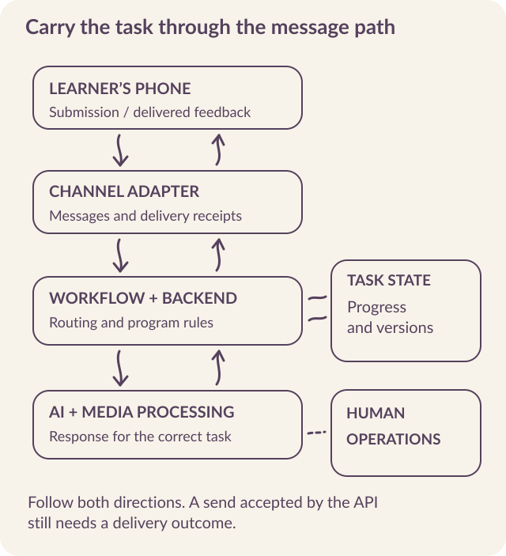
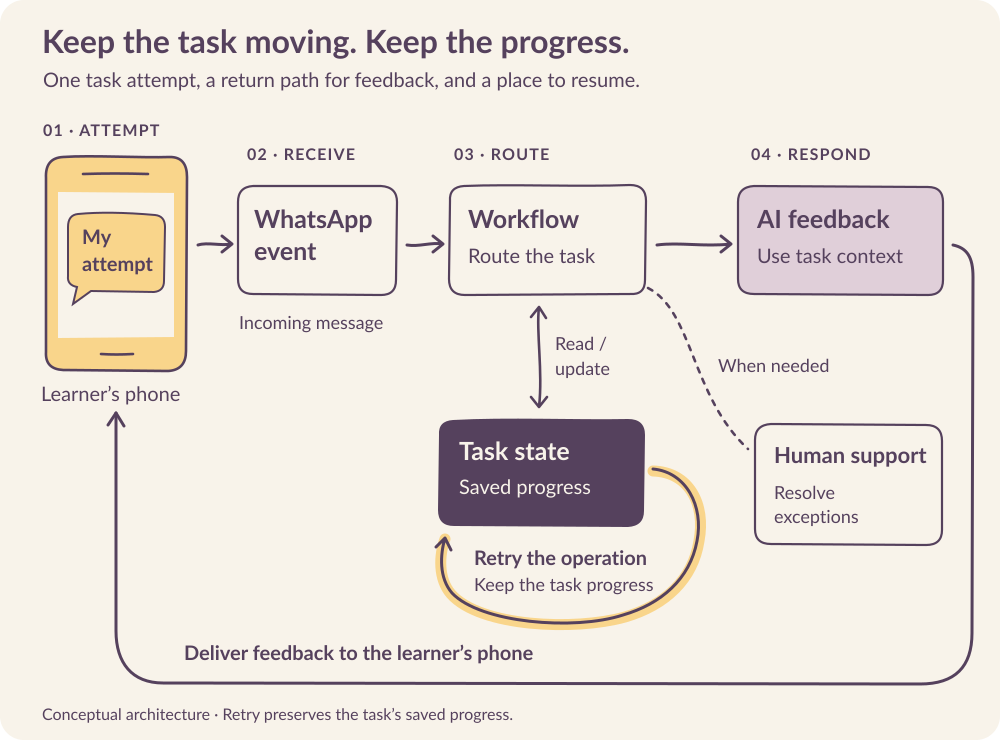

# Build the path from message to response

A learner submits an answer, loses their connection, and sends it again. The system must recognize the repeated event, preserve the work, and avoid issuing conflicting assessments. This is an ordinary messaging problem with a direct effect on the learning experience.

The first engineering milestone is **a complete path from a learner's phone to the program and back**. Establish that path, including its interrupted and failed states, before making the quality of the AI response your only test.

Kabakoo’s implementation brings together a WhatsApp provider, workflow automation, backend services, databases, media storage, and an AI layer. When a task stops working, the team needs to trace it across those components and find the failed step.

## Give each component a clear responsibility

Kabakoo initially used WATI to connect WLS to WhatsApp. n8n coordinated workflows; Django and Node.js services handled program logic; PostgreSQL on AWS RDS stored operational data; and S3 held media. HAKILI and AutoGen-based services supported the AI layer, with Langfuse for tracing. By August 2026, the Togo number used Turn.io, while migration of the wider system remained work in progress. [Architecture and provider history](../sources.qmd#s9).

A smaller pilot may combine several of these responsibilities in one service. <mark class="reading-mark">Keep the boundaries understandable even when the deployment is simple.</mark>

{#fig-architecture fig-alt="The message architecture separates channel delivery, workflow coordination, program state, AI processing, and human operations. Delivery receipts return through the provider, while task progress remains in the program database."}

| Responsibility | What the component must make possible |
|---|---|
| Channel adapter | Receive messages and status updates; translate provider payloads into internal events. |
| Workflow coordination | Route an event, expose a failed step, and retry safely. |
| Program logic | Decide which task is active and what a submission changes. |
| Operational storage | Preserve progress, control access, and restore from a tested backup. |
| Media handling | Associate files with the right task and apply access and retention rules. |
| AI processing | Use the relevant task, prompt, and model without taking ownership of program state. |
| Human operations | Resolve cases that require judgment, support, or recovery. |
| Observability | Connect the failure seen by a learner to the relevant events and component versions. |

The separation matters when a provider, model, or workflow changes. **A new model should not require rebuilding the learner's task history.** A provider migration should not erase the operations team's ability to investigate an undelivered response.

## Understand the stack {#stack}

The stack separates the learning program from message transport and AI processing. This makes it possible to change a provider or model while preserving tasks, submissions, and progress. Kabakoo’s May 2026 architecture and August evaluation workflow divide the responsibilities as follows. [Architecture](../sources.qmd#s9) · [Evaluation workflow](../sources.qmd#s18).

| Layer | Kabakoo implementation | Why the boundary matters |
|---|---|---|
| Channel | WhatsApp; initially WATI, with a later Turn.io-linked Togo number | Provider payloads, templates, receipts, and account permissions can change independently of learning state. |
| Workflow | n8n | Classifies incoming events, routes work, and makes failed workflow steps inspectable. |
| Application services | Django and Node.js | Keep learner profiles, progression, peer matching, and task validation outside the conversational model. |
| Operational data | PostgreSQL on AWS RDS; separate production and analytics data; dbt and scheduled ETL | A reporting query should not interrupt live learning. Transformation lineage connects a dashboard count to an event definition. |
| Media | AWS S3 with database references | A video is linked to a submission, with its own access, retention, and deletion responsibilities. |
| AI orchestration | HAKILI, a Django REST API using Microsoft AutoGen AgentChat | Conversation and knowledge services can evolve without making the model the authority on task completion. |
| Retrieval | Persistent ChromaDB collections; `text-embedding-3-small` | Knowledge updates need their own versions and retrieval tests. |
| Speech | Fine-tuned Whisper for recognition; a separate synthesis stage for spoken replies | Inspect transcription and generated speech separately before judging the whole voice exchange. |
| Traces and evaluation | Langfuse connected through Kabakoo’s `autofused`; Calibrate; Evidential | Trace prompts and cost, score outputs against rubrics, and connect experiments to product events. |

HAKILI’s May 2026 dependency specification included **Django 5.2.7**, Django REST Framework, and **AutoGen AgentChat 0.7.5**. These version numbers identify that implementation. For a new deployment, select supported versions, pin them, and test their compatibility together.

### Two API families in HAKILI

The **Messages API** generates conversational responses and proactive messages. The **Knowledge API** indexes and retrieves course knowledge. Separating them allows a team to investigate an irrelevant answer: was the wrong source indexed, the right source missed, or the retrieved context handled badly?

| API route | Responsibility | Acceptance question |
|---|---|---|
| `/api/messages/generate/` | Conversational generation through the adaptive agent flow | Is the answer tied to the correct question, task, and prompt version? |
| `/api/messages/proactive/` | Generate re-engagement content from unsent context | Does it remain relevant, and can the delivery layer send it under current channel rules? |
| `/api/knowledge/index/` | Index Notion content into collections | Can each chunk be traced to an approved source and version? |
| `/api/knowledge/retrieve/` | Semantic retrieval | Does the result supply relevant evidence for this task? |
| `/api/knowledge/embed/` | Generate embeddings | Are embedding model and collection versions compatible? |
| `/api/knowledge/clear/` | Clear collection data | Is the destructive operation restricted and recoverable? |

HAKILI also provides schema, documentation, and knowledge-test routes at `/api/schema/`, `/api/docs/`, and `/api/knowledge/test/`. The routes are relative to a HAKILI deployment. Functional API calls use an `X-Signature` header with HMAC-SHA256 authentication. **A valid signature identifies a caller; authorization still determines which collections and operations that caller may use.**

### Keep the data relationships explicit

The Django model separates `User` from `UserProfile`. A profile contains application state such as `is_ready_for_pod` and `whatsapp_session_closes_at`. Roles distinguish learners, peer facilitators, mentors, partners, and staff. A production phone-based identity can be linked to a pseudonymous analytics identifier without placing a phone number into every trace.

`Message` records direction, medium, scope (direct or group), sender, receiver or group, and any media reference. In the schema, `MessageReceipt` holds delivery and read information per recipient, with a uniqueness constraint on the message–recipient pair.

In July, the group-send path used the receipt field differently, leading the team to overestimate an incident’s reach. **Verify the writes behind the schema before using a receipt as evidence** of who received a message.

`MessageRelation` links questions and answers, including many-to-many relationships. A `Media` record identifies the stored file and its type.

A provider’s original payload is useful for diagnosis but can contain more information than a dashboard needs. The `full_data` JSON field therefore needs **restricted access and a retention rule**. The analytics transformation should select the fields that answer the research question.

The relationship to preserve is:

```text
Learner → active task → submission version
                         ↓
                 question ↔ answer
                         ↓
              outbound message → recipient receipt
                         ↓
                 learner's next action
```

**A read receipt ends at delivery evidence.** It cannot validate a task or establish that the learner understood the response.

### Keep group and private messages separate {#conversation-scope}

On July 1, 2026, group messages entered the private-message queue and produced **three unwanted direct-message copies**. The investigation traced the problem to five PostgreSQL query nodes in n8n's `Service: Process Message Queue`: none filtered by conversation scope. Two selected a message by ID without an ownership check. The fix added `AND scope = 'dm'` to all five queries. [Incident investigation](../sources.qmd#s34).

The incident also changed the impact estimate. An initial query found 91 group messages with receipts. But `whatsapp_message_receipts.user_id` meant the recipient in the private-send path and the sender in the group-send path. Eighty-eight receipts represented ordinary group sends.

Reconciliation with queue execution times isolated three duplicate sends affecting one learner and one group within about two hours. The original messages had also reached the group.

::: {.reading-note}
Carry conversation scope, conversation ID, and the authorized destination through retrieval, generation, and delivery. The July fix added a direct-message scope filter. **Test membership or ownership as well as scope**: a private message can still belong to the wrong conversation. Give sender and recipient distinct meanings in the data model.
:::

Rehearse the case with a group message ID submitted to the private queue. The queue should reject it before sending. Then test a private message belonging to another learner. Reconcile any suspected exposure with actual send executions and destination evidence; a count of ambiguously defined receipts is insufficient.

## Distinguish a message from an event about a message

A provider can send an incoming learner message, a delivery receipt, a button event, or a system notification. They must not all enter the same conversation path.

During the early sprint, a Start-button interaction generated a provider ticket that was interpreted as a learner response. The resulting error occurred before the model had a meaningful question to answer. **Classify events at the entry point**, before routing them into a conversation. [Sprint record](../sources.qmd#s1).

Define an internal event representation that keeps the event type, external identifier, relevant task, and processing status separate. For example:

```yaml
event_type: learner_submission
external_event_id: provider-event-example
learner_id: pseudonymous-example
assignment_id: service-description-01
received_at: timestamp
input_type: text
conversation_scope: dm
conversation_id: private-conversation-example
processing_status: received
```

Choose the fields your operation needs and document their meaning. A pseudonymous learner identifier still needs protection if the organization can link it to a person. Avoid copying an entire provider payload into every log merely because it is available.

## Preserve progress when delivery is interrupted

::: {.reading-band}
**Program state and messaging eligibility answer different questions.**
:::

Program state tells you which task the learner is working on and what has already been completed. Messaging eligibility tells you what the channel currently permits you to send.

WhatsApp's customer-service window is based on the user's most recent message. Outside the permitted window, proactive contact requires an approved template under the applicable rules. A reminder sent by the program is not a user reply and does not itself reopen that window. **Keep the learner's progress even when the next outbound message must wait.** [Business Messaging Policy](https://business.whatsapp.com/policy).

Kabakoo’s queue processor applies internal spacing and reminder-count rules. Such product rules operate within channel eligibility; they cannot expand it. A useful queue decision checks opt-out, task relevance, prior processing, and permitted message type before sending.

```text
Confirm that contact is still permitted.
Confirm that the queued message still fits the learner's current task.
Check whether this event or outbound action was already handled.
Choose an allowed message type under the channel's current rules.
Record the outbound action and its status.
Send, then reconcile the provider's delivery updates.
```

Protect this sequence against concurrent workers and failures between steps. Commit related state changes together, and make unfinished work recoverable.

## Follow a message, including the detour {#message-trace}

```{=html}
<figure class="wide-diagram"><div class="diagram-scroll" tabindex="0" role="region" aria-label="Message journey diagram; scroll horizontally on a narrow screen"></div><figcaption>A retry returns to saved progress; it does not restart the learning task.</figcaption></figure>
<div class="trace-lab">
<p class="eyebrow">TRY AN ENGINEERING CASE</p>
<label for="trace-case">What happens after the learner sends the work?</label>
<select id="trace-case"><option value="ordinary">The ordinary path</option><option value="duplicate">The provider repeats the webhook</option><option value="timeout">The outbound request times out</option><option value="stale">Old feedback arrives after a revision</option><option value="closed">The messaging window closes</option><option value="scope">A group message enters the private queue</option></select>
<div id="trace-result" role="status"><h3>The ordinary path</h3><ol><li>Record the incoming event and identify the active task.</li><li>Generate feedback linked to this submission version.</li><li>Store outbound work, send it, and reconcile the delivery receipt.</li><li>Leave the task ready for the learner’s next action.</li></ol></div>

</div>
```

### The delivery queue has its own job

In the May 2026 queue design, **CHAT** identifies a response associated with a particular question. **AUTO** identifies proactive work subject to spacing and session checks, including a one-hour spacing rule and a 61-minute queue recheck. These scheduling rules still operate within WhatsApp’s customer-service window.

The send adapter then translates text, media, template, or button content into the provider request. **Keep generation and delivery separate**: an AI-generated reminder is not automatically an approved WhatsApp template. Match an allowed template and its parameters when a template is required.

In September 2026, Kabakoo moved scheduled reminders to **23 hours after the learner’s last message**, aiming to act before the 24-hour window expires. <mark class="reading-mark">Recheck eligibility when the worker actually sends</mark>: a delayed job can miss its intended window. Also recheck opt-out and whether the task is still relevant. [September operations update](../sources.qmd#s19).

## Handle duplicates and uncertain sends deliberately

Repeated webhooks are expected in many delivery systems. Use a uniqueness constraint on the external event identifier and preserve the relationship between the received event, state change, and resulting outbound work. A durable queue or outbox can help prevent a crash from losing a response after the task state has changed.

Outbound delivery introduces another ambiguity. A send request can time out after the provider has accepted it. Retrying immediately may create a duplicate. Preserve the provider identifier when available and **reconcile status before repeating an uncertain send**.

**Limit retries and expose unresolved cases to an operator.** Record whether an API request was accepted, whether a delivery report arrived, and what remains unknown. A successful backend request is not the same event as a learner receiving feedback.

For the service-description exercise, test the duplicate submission explicitly. The learner's revised work must not be replaced by a delayed response to the earlier attempt. A task version or submission reference helps the system identify which work the feedback concerns.

### A small transaction boundary to rehearse

Adapt this pseudocode to your event and task records. It separates accepting work from the network call that may fail.

```python
with database.transaction():
    # Unique within the provider account and event category.
    event = accept_once(provider, account, event_kind, external_id)
    if event.already_processed:
        return acknowledged()
    task = lock_current_task(learner_id)
    submission = record_attempt(task, event)
    enqueue_generation(submission.id, task.version)
    mark_event_processed(event)

# A worker generates feedback and records its outbound work durably.
# Another worker checks relevance and messaging eligibility at send time.
# A timed-out send stays uncertain until reconciled or reviewed.
```

::: {.reading-rule}
**Do not hold the database transaction open while calling the model or the messaging provider.** Use a durable job or outbox record so the accepted task change can be recovered after a worker crash. A production design also needs bounded retries, job leases, authentication, and an operator path for uncertainty. **Test a crash before and after each durable write and external send.**
:::

## Test the permissions behind a successful setup

Kabakoo’s August 24, 2026 Groups API test could create and manage groups, obtain invite links, and receive webhooks. Sending through the tested direct API path failed, including one-to-one sends. By September 9, Meta’s support response had pointed to the WABA credit line held by the business solution provider, Turn.io for Togo. Turn.io had been asked to open its own support case; a resolution was still pending. [Investigation](../sources.qmd#s8) · [September update](../sources.qmd#s19).

**Test the operation the program depends on**. Group creation does not demonstrate that members can exchange the messages the learning design requires. Test invitation, joining, sending, receiving, and leaving with the actual account arrangement.

The August 2026 test worked within limits of eight participants, invite-based joining, and no interactive button or list messages inside groups. Verify the [current Groups API documentation](https://developers.facebook.com/documentation/business-messaging/whatsapp/groups) before implementation.

As of September 2026, Kabakoo’s WATI **Professional** account allowed unlimited chatbots, **50 nodes per chatbot**, and **10 webhooks**. Group management worked, but sending through the tested WATI API remained unavailable. Check both account limits and message delivery with the provider arrangement your program will use.

### Check the agreements as well as the API

On September 9, 2026, Meta’s public terms page announces new **Meta Terms for WhatsApp Business Platform** effective September 23. Its current October 2025 text also incorporates the separate **WhatsApp Business Solution Terms**; that separate document, modified March 6, 2026, already contains AI-provider and data-use restrictions. The absence of an AI clause in one document does not establish its absence from the agreement as a whole. [Meta terms](https://www.whatsapp.com/legal/meta-terms-whatsapp-business) · [Business Solution Terms](https://www.whatsapp.com/legal/business-solution-terms?lang=en).

Review the final applicable terms, territories, data flows, and provider arrangement before deployment. In September, Kabakoo was also seeking confirmation of its eligibility for a privately communicated nonprofit pricing exemption and of which charges it would cover. **Do not build a cost forecast on that exemption until it is confirmed for the account.**

## Make a provider change survivable

A migration affects more than the webhook URL. Inventory approved templates, delivery identifiers, media handling, account permissions, billing arrangements, and the inbox used by support staff. Test the replacement against representative flows and define what returning to the previous arrangement would require.

Kabakoo also maintains an app as another route into the program. An additional application becomes a workable fallback only when learners can reach it and the team has practiced the transition. Preserve program state in a form that can support that work.

A pilot should therefore include <mark class="reading-mark">one recovery rehearsal</mark>: interrupt a dependency, identify the affected learners or tasks, and restore a usable path. Record the staff actions as carefully as the code changes.

## Collect enough evidence to investigate a failure

A useful trace links the task and submission to the prompt version, model version, response, timing, and failure state. It should help answer a concrete question, such as why a learner received feedback for the wrong task or why a voice response never arrived.

Tracing also creates data that must be governed. Restrict access according to staff responsibilities and set retention rules for messages, media, and model traces. Separating production and analytics databases can isolate reporting from live operations; **it does not make the copied information anonymous**.

::: {.reading-note}
In February 2026, Kabakoo masked first names and planned a fuller self-hosted anonymization layer. **Free text and audio can still identify people after a profile field has been masked.** Assess the actual content and permissions before sending it to an external model or tracing service. [Data handling and planned changes](../sources.qmd#s10).
:::

For HAKILI’s HMAC-SHA256 request authentication, define the exact request representation being signed, compare signatures in constant time, reject stale timestamps, and address replay within the accepted window. Protect the signing keys and limit each caller's permissions. [Python HMAC reference](https://docs.python.org/3/library/hmac.html#hmac.compare_digest).

Apply the same operational discipline to media: allowed types and sizes, safe handling of invalid files, access controls, and deletion of both the database reference and stored object. Identify any additional copies retained by the provider.

## Accept the system from the learner's device

Use the [architecture acceptance checklist](../resources.qmd#architecture) to test an ordinary task, duplicate input, interrupted progress, expired messaging eligibility, failed media, an uncertain send, opt-out, and human escalation. Add the group lifecycle if the pilot uses pods.

For each case, inspect **what reaches the phone, what the database records, and what an operator can see**. The acceptance record should name the tested version, result, unresolved issue, and person responsible for it. Once this path works, the next question is whether the mentor's response helps the learner do the work.
