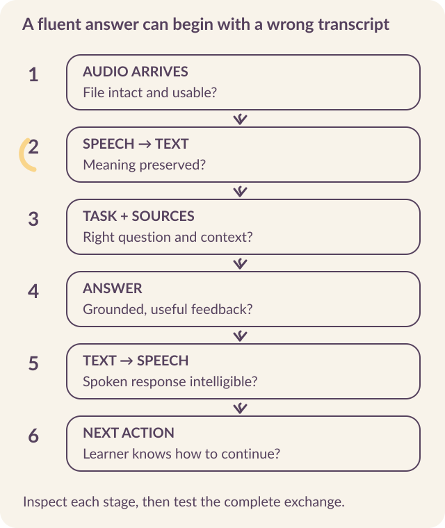
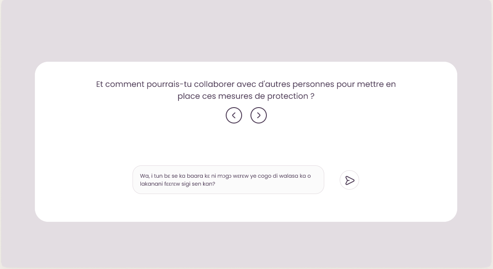

# Design and evaluate the AI Mentor

In March 2026, a learner submitted the introduction video required for her first challenge. The AI Mentor rejected it. She did not try again. When the team contacted her later, she identified the rejection as her reason for leaving.

The rejection changed how we thought about assessment. Applying the rubric was one part of the mentor’s job. **Helping someone understand the decision and attempt the work again** was another. We needed to follow the response beyond the model test and into the learner’s experience. [The AI worked. Did it work for the learner?](https://kabakoo.substack.com/p/the-ai-worked-did-it-work-for-the).

An AI Mentor needs a defined role, reviewed examples against which to test it, and follow-up on what happens when its response reaches a learner. Multilingual voice interaction adds further points where meaning can be lost.

## Specify the job before evaluating the answer

Kabakoo's mentor supports questions, task feedback, reflection, and participation in learning activities. **Each function needs its own account of a useful response.** Exploration of a project idea calls for different behavior from assessment of a completed assignment.

For the service-description exercise, specify what the mentor is allowed to assess. It can check whether the submission identifies the service, intended customer, and problem addressed. It should not invent a new requirement or promise that the proposed offer will attract customers.

Write the task information the model may use, the criteria it should apply, the response it should produce, and the cases a human should review. Include behavior after uncertainty: asking a clarifying question, offering another response format, or referring the case to a facilitator.

In a pod, the specification also needs a rule for entering the conversation. **An answer can be correct and badly timed.** Evaluate whether the intervention gives peers something to work with and leaves room for them to contribute.

## Make feedback usable

::: {.reading-band}
A useful assessment distinguishes three things: **what the learner has done, what remains unclear, and what they can do next**.
:::

The wording should point to the submitted work rather than deliver a general verdict on the learner's ability.

For the service-description exercise, compare two responses. “Your answer is incomplete” reports a classification. “You have described the service. Who would use it, and what problem would it solve for them?” identifies the remaining task. Whether the latter works still needs to be tested with the intended learners, but its next action is explicit.

A reviewer should also examine the burden of that next action. Asking for another large video upload may be disproportionate when a short clarification would resolve the issue. The learning objective, accepted format, and feedback need to agree.

## Locate the failure in a voice exchange

A spoken interaction passes through several systems. Audio must arrive, speech must be recognized, the task must be interpreted, an answer must be generated, and the spoken response must be intelligible. An error near the beginning can produce a fluent but irrelevant answer at the end.

{#fig-voice fig-alt="A voice pipeline shows where to inspect received audio, transcription, task interpretation, answer generation, speech synthesis, and the learner’s next action."}

Whisper performs speech recognition: it converts audio into text. Speech synthesis converts text into an audible response. **Evaluate them separately, then test the complete interaction.**

Include code-switching and changes of format. Kabakoo's June 2026 analysis found learners moving between French and Bamanankan across topics and interactions. A fixed language label at registration can miss that pattern. The system should preserve the learner's ability to express a question in the form they can use. [June 2026 update](https://kabakoo.substack.com/p/kabakoo-monthly-update-062026).

For each failed exchange, retain an appropriately governed record of what arrived, what the system understood, what it answered, and what the learner experienced. This makes it possible to correct the component responsible instead of treating every problem as a prompting failure.

## Trace a question through two languages {#follow-the-actual-language-pipeline}

In August 2026, Kabakoo’s Bamanankan voice pipeline used French for the language-model response. A spoken question passed through recognition and translation before reaching the model. Its answer then had to travel back through translation and speech synthesis. [Voice architecture](../sources.qmd#s21).

```text
Bamanankan audio
    ↓ speech recognition
Bamanankan transcript
    ↓ machine translation
French text + conversation history
    ↓ language-model response
French answer
    ↓ machine translation
Bamanankan answer text
    ↓ speech synthesis
Bamanankan audio returned to the learner
```

<mark class="reading-mark">Each conversion can change meaning.</mark> Keep the received audio, recognized transcript, translated question, generated answer, back-translation, and spoken output distinguishable in a governed test record. A correct transcription does not guarantee a correct translation; a correct text answer does not guarantee intelligible speech.

### Read speech results with their test sets

Kabakoo’s early Whisper baseline had a **word error rate (WER) of 0.98**. In 2025, fine-tuning on ten hours of community-recorded audio yielded **0.64** on the “Alan” test set.

By August 2026, the team was training **Whisper medium, with 769 million parameters**, by alternating Kabakoo’s curated data with existing Bamanankan speech datasets. That model achieved **0.24** on Kabakoo’s held-out set and **0.33** on an external Bamanankan benchmark. [Speech evaluations](../sources.qmd#s21).

| Evaluation | WER | How to interpret it |
|---|---|---|
| Generic Whisper baseline | 0.98 | Starting point before fine-tuning. |
| 2025 fine-tune, “Alan” test set | 0.64 | Performance after training on ten hours of community-recorded audio. |
| August 2026 fine-tune, Kabakoo held-out set | 0.24 | Performance on the team’s own held-out data. |
| Same August model, external Bamanankan benchmark | 0.33 | Evidence of a gap when tested outside the in-house split. |

::: {.reading-note}
**The 0.64 and 0.24 results use different test sets**, so their difference cannot measure improvement on the same material. To compare versions, hold the evaluation data, speaker separation, preprocessing, and scoring procedure fixed. WER measures transcription errors; a learner may still receive an unusable answer even when the words were recognized correctly.
:::

### Test a shorter voice pipeline {#name-the-experiments-still-ahead}

Could one conversion be removed? In August 2026, Kabakoo was experimenting with a direct **Bamanankan-audio-to-French-text** route. Reasoning or retrieval more directly in Bamanankan, and further use of vocational training audio, were also proposed directions. [Pipeline experiments](../sources.qmd#s21).

Test each change against the existing pipeline using the same examples and the same end-to-end task. A shorter path is useful only if it preserves meaning and returns an answer the learner can act on.

## Build language data with a review process

To build the Bamanankan dataset in February 2025, Kabakoo started with topics people were raising in the app. The team developed French sentences from those topics, then worked with translators and language specialists to translate, review, record, and correct them. A dedicated interface supported that work. [Before Training the Data!](https://www.kabakoo.africa/news/before-training-the-data).

{#fig-translation fig-alt="A French sentence above its Bamanankan translation in Kabakoo’s translation interface."}

The team observed quality problems as workload increased and capped translation at one hundred sentences per person per day. A supervisor sampled a quarter of each submitted batch; an error returned the batch for correction. Translators also gained a way to review and edit their work before submitting it.

During recording, making the French sentence available alongside the Bamanankan text helped contributors interpret the intended meaning. Recording guidance and audio review addressed further quality problems. The workflow had to preserve **the relationship between source sentence, translation, recording, and correction**.

Set the review workload and sampling rate according to the errors your team finds. For every item, retain its origin, permitted uses, versions, reviewers, and restrictions. When a translation fails, you should be able to find the affected recordings and correct them too.

<mark class="reading-mark">Separate training and evaluation material.</mark> Check for speakers or near-duplicate sentences crossing the split, and document how the test set was constructed. Otherwise an apparent improvement may partly reflect familiarity with the material.

## Use a small test to find specific failures

In a Bamanankan mentor test on August 12–13, 2025, six ratings came back: 2, 5, 1, 3, 3, and 1 out of five, averaging **2.5/5**. Testers encountered misunderstood questions, answers that drifted off topic, and errors in speech or meaning. Six ratings cannot establish how the mentor performs across its users, but those specific failures give the team something to reproduce and repair. [Bamanankan user test](../sources.qmd#s12).

::: {.reading-rule}
**An aggregate score should lead back to examples.** Which part of the question was lost? Was the response wrong because of transcription or because the model misunderstood a correct transcript? Could the person understand the spoken output? Each answer points toward a different correction.
:::

Report speech-recognition results with the model version, date, dataset, split, and scoring procedure. Word error rate counts substitutions, deletions, and insertions relative to a reference transcript. It does not directly measure whether the learner's task succeeded. One mistaken word about a material, amount, or action may matter more than several errors elsewhere in the sentence.

### Test the spoken reply with the person hearing it

Fifteen visitors tested the Bamanankan agriculture mentor at SENUMA in January 2026. They encountered speech that was too fast, unfamiliar phrasing, answers that missed the question, and repeated attempts before being understood. Some described **waiting four to five minutes**. That demonstration predates the August model; its waiting-time accounts identify a delivery problem but cannot supply a latency distribution. [SENUMA feedback](../sources.qmd#s35).

| Part of the exchange | What to examine with the listener |
|---|---|
| Recognition | Did the transcript preserve the question, including hesitations and local terms? |
| Meaning | Did translation and generation preserve the intended task? |
| Spoken answer | Can the person explain it back at the delivered pace and in the spoken register? |
| Relevance | Does an understandable answer actually address the question? |
| Delivery | How long did the complete exchange take, and could the person continue? |

The 2023 voice interviews add a separate consideration: some people wanted to speak a question but read the answer, or listen only when they chose. Others worried about recordings being forwarded or reused. **Test input and output preferences separately**, explain who receives recordings and how they are used, and preserve a suitable alternative. [Voice interviews](../sources.qmd#s33).

## Close the loop across the four levels {#evaluation-loop}

Kabakoo’s evaluation workflow connects **Langfuse** prompt and model traces, **Calibrate** rubric scores, **Evidential** A/B tests, and a **Postgres warehouse with dbt** for reconciling logs, surveys, and funnel data. Each addresses a different part of the question. The Agency Fund’s [four-level framework](https://eval.playbook.org.ai/) helps organize what those tools can tell us. [Kabakoo’s evaluation practice, August 2026](../sources.qmd#s18).

| Question | What to connect | What the tool cannot establish alone |
|---|---|---|
| Did this response meet the criteria? | Submission, prompt, model, retrieved context, rubric, reviewer | Whether the learner could use the response. |
| Did the product deliver a useful interaction? | Trace, delivery state, first action, return, experiment assignment | Whether continued use changed capability. |
| Did something change for the learner? | Work samples, interviews, baseline and follow-up measures | Whether the change would have happened anyway. |
| Did the intervention improve livelihoods? | Defined exposure, longitudinal outcomes, credible comparison | Which component caused the effect without a design that separates components. |

The learner who left after a rejected video and Maimouna, who found the courage to submit videos through encouraging feedback, had very different experiences of assessment. Both show why **tone, recovery, and the next attempt belong in evaluation**. Recreate the rejection failure in a model test, then follow what happens to learners who encounter it. [Learner experiences](../sources.qmd#s18).

Keep a shared review record: the observed failure, the affected interaction, the proposed correction, the prompt or product version, and the follow-up question. **A release can pass its model checks and still need a product change.**

## Build an evaluation set around the mentor's work

Collect permission-cleared examples or deliberately construct cases for testing, keeping their origin explicit. Include ordinary submissions, incomplete work, unusual but valid answers, ambiguous questions, poor audio, and cases requiring human review. The examples should reflect the functions the pilot will actually offer.

Kabakoo’s May 2026 Level 1 rubric assesses grounding, instruction-following, safety, tone and dignity, and usefulness. Apply those criteria to the learner’s actual task: could they trust the assessment, understand it, and use it? [Evaluation rubric](../sources.qmd#s13).

| Review question | Evidence to examine |
|---|---|
| Did the mentor understand the request? | Its answer addresses the submitted question or work. |
| Did it use the right material? | The task, criteria, and retrieved information support the response. |
| Is the assessment defensible? | The decision agrees with the reviewed evidence or exposes a justified uncertainty. |
| Can the learner act on the feedback? | The next step is specific and appropriate to the task. |
| Is the language usable and respectful? | Intended users can understand the response without being demeaned or misled. |
| Does it preserve human judgment where needed? | Contested, ambiguous, or unsuitable cases reach the agreed support route. |

<mark class="reading-mark">Ask reviewers to explain disagreements.</mark> A disputed example often reveals an unclear criterion or a legitimate approach the team had not considered. Revise the specification before expecting the model to apply a rule that people cannot interpret consistently.

## Inspect what an evaluation actually covered {#mentor-failures}

In Kabakoo’s May 22, 2026 baseline, the mentor scored 4.8/5 for posture and empathy, 3.8/5 for instruction-following, 2.2/5 for conciseness, and 1.5/5 for lexical adherence. The failures called for specific corrections; confirming a repair requires another test of the changed version. [May baseline and proposed corrections](../sources.qmd#s13).

::: {.reading-note}
In a separate May stress test, **two of 25 curated cases passed**. A pass required correctness and a perfect score on every dimension assessed for that case. This demanding rule helps expose failures in selected cases; it cannot estimate the failure rate of everyday use. Keep this test separate from the May 22 baseline because their coverage differs. [Results updated June 11](../sources.qmd#s36).
:::

```{=html}
<div class="explorer" data-deck="mentor-failures" aria-label="Mentor evaluation failures and coverage">
<section class="explorer-panel" data-panel="Too much at once" id="mentor-failure-1"><h3>A complete plan can prevent a next step</h3><p>In the May baseline, the mentor answered with exhaustive ten-step plans. In the separate stress test, the median response was 184 words long, and all six WhatsApp-formatting tests failed.</p><h4>What to test</h4><p>Give one feasible step, let the learner respond, and preserve the wider plan for later. Examine whether the person can act on the first step.</p><p class="takeaway">Response length needs to serve the task and the channel.</p></section>
<section class="explorer-panel" data-panel="Changing register" id="mentor-failure-2"><h3>The voice changes within the reply</h3><p>In the May baseline, replies began with the familiar French “tu” and switched to the formal “vous.” A warm opening did not ensure consistency through the answer.</p><h4>What to test</h4><p>Review the complete response in context. Check language, register, and dignity with people who understand the intended interaction.</p><p class="takeaway">Check language and register throughout the response.</p></section>
<section class="explorer-panel" data-panel="Missing human connection" id="mentor-failure-3"><h3>Make peer support part of the response</h3><p>In the May baseline's community-learning case, the mentor offered individual AI help where the test expected a peer or community route.</p><h4>What to test</h4><p>Check whether a relevant connection exists, whether the learner wants it, and whether the introduction works. Then follow up on the help exchanged.</p><p class="takeaway">The theory of change needs to appear in the behavior being evaluated.</p></section>
<section class="explorer-panel" data-panel="Missing coverage" id="mentor-failure-4"><h3>An untested dimension remains unknown</h3><p>Build cases around the actual service's risks and escalation routes. Record what was tested, the results, and what remains uncovered before a release decision.</p><p class="takeaway">A rubric containing a dimension is different from an evaluation that tested it.</p></section>
</div>
```

When a prompt, model, or retrieval component changes, **rerun the relevant examples and inspect regressions**. Preserve the version and release decision with the results. A new average score should not conceal a newly introduced failure that makes an important task unusable.

A model change can also change how progress is counted. In a randomized app experiment reported in May 2025, learners assigned to the multi-agent experience completed an average of **1.33 fewer tasks** than those assigned to the single-agent experience, with p=0.03. Stricter validation was one possible explanation, but remained untested. **Preserve attempts and assess the work against a common rubric**: fewer system validations could reflect changed judging, changed participation, or both. [Single-agent and multi-agent experiment](../sources.qmd#s14).

## Follow the response into the learning experience

Controlled evaluation cannot show everything that happens in delivery. Check whether the feedback arrived, whether the learner understood it, and whether they revised, asked for help, or stopped. When someone stops, **follow-up can supply an explanation that model traces cannot**.

Keep the people who never submitted in view. A quality score calculated only on received work says nothing about those who could not reach that point. Examine access, first action, and response quality together, using the distinct measures developed in chapter 2.

The introduction-video case illustrates why this matters. The team learned the consequence of the rejection through contact with the learner. Building that contact into operations makes evaluation part of the learning system rather than an exercise confined to model outputs.

## Give contributors a say in how language data is used

Kabakoo's Bamanankan Data Management Protocol meeting on May 24, 2025 involved eight contributors and language experts. They discussed purpose, access, recognition, privacy, withdrawal, and future governance, with differing views. The practical work was to make those questions explicit and develop arrangements that could honor contributors' choices. [Consultation record](../sources.qmd#s15).

**Distinguish participation in the learning service from additional recording, research, or training-data uses**. Explain intended uses before collection and establish how changes will be discussed. A withdrawal process needs an operational account of which records can be removed, where copies exist, and what limits have been explained.

Use the [mentor evaluation worksheet](../resources.qmd#mentor) to connect task examples, model and prompt versions, reviewer judgments, corrections, and release decisions. Add the follow-up you will conduct with learners. Check both the response and what the learner could do with it.
