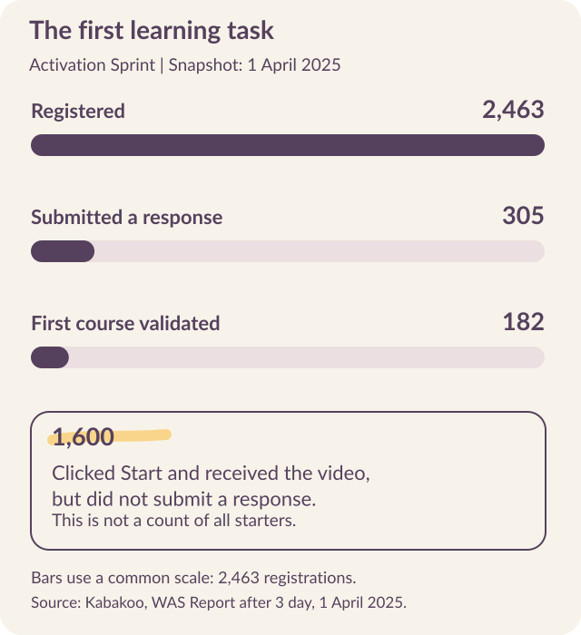
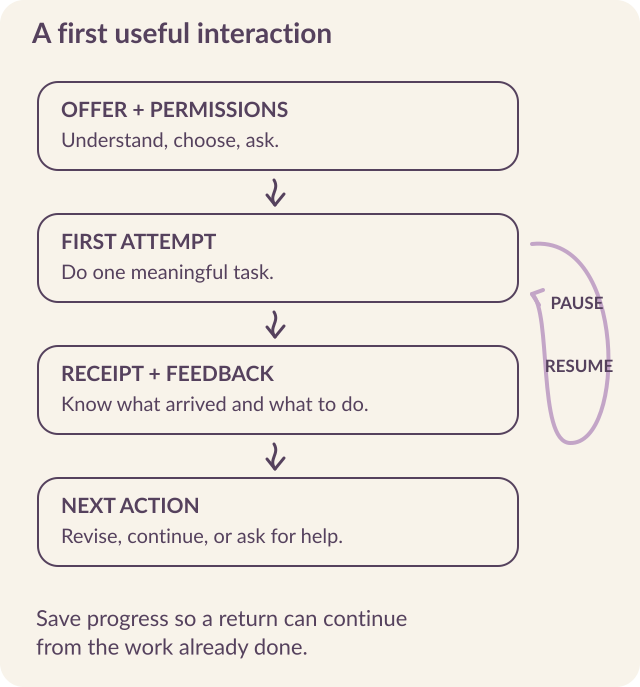

# Design the first useful interaction

Before a learner meets the curriculum, they meet an offer. Someone has sent a message asking for their time, information, or work. The first task of onboarding is to make that request understandable enough for the person to **choose whether to continue**.

The next task is to <mark class="reading-mark">help them experience something useful</mark>. In a learning program, that could be an attempt they can complete, feedback they can act on, or contact with someone who helps them take the next step. Registration makes participation possible; the design must carry the person beyond it.

In Kabakoo’s early sprint and later cohorts, many interested learners stopped before a first achievement. Understanding that gap meant examining the invitation, the task, and the help available at each step.

## Read the sprint at the point where learning should begin

By April 1, 2025, the sprint had attracted 2,463 registrations. Only 305 people had submitted a response to the first course, and 182 had passed its validation. Another 1,600 registrants had clicked Start and received the video but had submitted no response. [Sprint record](../sources.qmd#s1).

{#fig-sprint fig-alt="The sprint snapshot distinguishes registrations, first-course submissions, and validations. A separate annotation identifies the 1,600 people who received the video after clicking Start but did not submit."}

The largest unresolved step lay **between entering the program and sending a first response**. Calls and operational notes made that step more concrete: some learners wanted to write rather than record their answer; others were confused by repeated rejection or encountered media and validation problems.

**Those 1,600 had received the lesson but had not sent a response.** They are a subset of non-submitters, which makes the instruction and response format a specific place to investigate.

The investigation led toward clearer orientation, more flexible response formats, and better feedback.

::: {.reading-band}
It also established a method: **use events to locate a break, then ask people what happened there**.
:::

## Investigate the gap before the first reply {#walsh}

> “A single large cliff at the very first step.”
>
> — Jamie Walsh, The Agency Fund, *Kabakoo Onboarding Funnel — Diagnostic & Proposals*, March 31, 2026. [Analysis and denominators](../sources.qmd#s17).

Walsh examined onboarding after the March 2026 Missabougou recruitment campaign. Among the **826 people in the onboarding event table**, 367 people clicked the first “Let’s go!” button and 459 did not respond: **44.4% versus 55.6%**. Among those who entered, losses were spread through the later questions. The first invitation therefore deserves its own product investigation.

```{=html}
<div class="evidence-bars" aria-label="March 2026 onboarding, 826-person event-table population">
<div><span>First button clicked</span><strong>367 / 826 · 44.4%</strong><div class="bar-track"><span style="width:44.4%"></span></div></div>
<div><span>No first response</span><strong>459 / 826 · 55.6%</strong><div class="bar-track"><span style="width:55.6%"></span></div></div>
<p class="source-note">Jamie Walsh · March 31, 2026 · Onboarding event table · 826 people.</p>
</div>
```

::: {.reading-note}
The campaign total of **224 completions among 837 invitations** and the chat logs covering **853 people** use different populations from this 826-person comparison. **Reconcile who belongs in each population before joining these counts into a funnel.**
:::

Walsh proposed three explanations: motivation fading between field registration and the message, an invitation that does not connect to the learner’s goals, and a trust gap when an unfamiliar number appears. **Chat logs alone cannot distinguish them.** Repeated templates without a response locate a break; interviews and delivery evidence help explain it.

Walsh proposed three tests: connect the invitation to the original encounter, coordinate a peer introduction, and shorten the registration-to-invitation delay. **Their effects remain to be tested.** The timing experiment first needs registration timestamps, which were missing from the data Walsh analyzed. For each experiment, define the first-response outcome, keep assignment records, and inspect later learning actions so a better click rate does not become the endpoint.

[Open the onboarding working notes](../resources.qmd#onboarding).

## Make the offer credible and specific

The 2024 Mali youth trust survey helped direct Kabakoo toward WhatsApp: **it led respondents' preferred channels for institutional information**, while parents, teachers, and close friends led trust in people. The later Missabougou research found limited awareness of Kabakoo alongside widespread use of WhatsApp. A familiar channel could deliver the message, but it could not supply the explanation of who was behind it. Local contact, community networks, and institutional relationships therefore belonged in the outreach design. [Trust survey](../sources.qmd#s39) · [Missabougou research](../sources.qmd#s29).

::: {.reading-rule}
An invitation should identify the organization, explain the activity, describe the expected effort and relevant conditions, and show how to ask for help. **Give the person enough information to make a choice** before asking them to complete a long form.
:::

For the proposed service-description exercise, the offer might explain that learners will practice describing a service, receive feedback, and revise their explanation. It should not promise that completing the exercise will produce a customer or an income gain. Those are different outcomes with different dependencies.

**Record the recruitment route** when it is relevant and permitted. A referral from a trusted person can change how the same invitation is received. This helps the team understand which part of the experience it is actually testing.

## Let the task teach the interface

The first useful activity can introduce the response format, receipt message, feedback, and route to help. This makes orientation part of doing the work.

{#fig-entry fig-alt="A proposed onboarding sequence moves from an understandable offer and permissions to a first attempt, receipt, feedback, and another action. A return path preserves progress after interruption."}

For each stage, define what the learner should understand before continuing:

| Stage | What the person should be able to explain |
|---|---|
| Offer | Who runs the activity, what it involves, and whether they want to join. |
| Information and permissions | What information is needed, who can see it, and which choices are optional. |
| First attempt | What to produce and which response formats are accepted. |
| Receipt | Whether the work arrived and what will happen next. |
| Feedback | What the response means and how to revise or progress. |
| Help or return | How to reach a person or continue after an interruption. |

Test this understanding by **asking participants to explain the step in their own words**. Merely displaying a message does not tell the team whether its meaning was clear.

Kabakoo's early design introduced shorter instructions, progress markers, and waiting messages. Internal tests with fourteen testers in three groups helped examine the sequence. Research with intended users then needed to establish what remained unclear outside the team. [MVP preparation](../sources.qmd#s2).

## Inspect the onboarding screens

Inspect how the introduction, questions, and menu guide the learner’s next action.

```{=html}
<div class="explorer" data-deck="onboarding" aria-label="Onboarding screen walkthrough">
<section class="explorer-panel" data-panel="Welcome" id="onboarding-1"><h3>Welcome</h3><div class="screen-and-note"><figure></figure><div><p class="eyebrow">WHAT THE SCREEN ASKS</p><h4>Explain who is speaking</h4><p>The introduction names the AI Mentor and its role. Ask someone unfamiliar with Kabakoo who they think is speaking, what help is available, and what continuing involves.</p></div></div></section>
<section class="explorer-panel" data-panel="Motivation" id="onboarding-2"><h3>Motivation</h3><div class="screen-and-note"><figure></figure><div><p class="eyebrow">WHAT THE SCREEN ASKS</p><h4>Ask a question that earns its place</h4><p>The screen asks about readiness, learning goals, and whether a project already exists. Each answer should have an identifiable use in the experience.</p></div></div></section>
<section class="explorer-panel" data-panel="Goals" id="onboarding-3"><h3>Goals</h3><div class="screen-and-note"><figure></figure><div><p class="eyebrow">WHAT THE SCREEN ASKS</p><h4>Connect the next step to a real ambition</h4><p>The options include earning more, developing a project, confidence, and direction. Avoid treating a selected option as a complete account of the person’s livelihood.</p></div></div></section>
<section class="explorer-panel" data-panel="Return to the menu" id="onboarding-4"><h3>Return to the menu</h3><div class="screen-and-note"><figure></figure><div><p class="eyebrow">WHAT THE SCREEN ASKS</p><h4>Let people find their work again</h4><p>The menu brings together the mentor, core modules, grins, portfolio, attendance, and bug reporting. A returning learner needs to find the active task without repeating the whole introduction.</p></div></div></section>
</div>
```

## Collect information when it is needed

Every question asks for effort before the learner has necessarily received value. Distinguish information needed to run the service from information collected for research, matching, or later personalization. Ask when each item becomes necessary and whether the request makes sense at that point.

In February 2026, Kabakoo’s T0 baseline contained more than eighty questions. The February 18 follow-up protocol asked learners to allow at least thirty minutes and told them that completion was required to enter training. <mark class="reading-mark">The research instrument was therefore also a participation gate.</mark> A funnel beginning only after baseline completion would miss people excluded at that gate. [T0 protocol](../sources.qmd#s37).

Test the baseline on the same phones, connections, languages, and available time as the learning activity. Keep an appropriate recruitment record for people who do not finish, and distinguish a technical interruption, an unanswered question, and a decision to stop. Where a baseline is required before exposure, design accessible administration and a return path with the research team; preserve the timing and comparability the study needs.

By August 2026, Kabakoo was redesigning a baseline of roughly sixty to seventy questions toward approximately twenty, with shorter follow-ups and observations distributed through participation. The team also found that shortening the questionnaire could lose substantial information. **Reducing burden and preserving measurement both required design work.** [August 2026 update](https://kabakoo.substack.com/p/kabakoo-monthly-update-082026).

The July analysis of baseline questions gives that redesign a sharper rationale. It linked 851 rows across three survey waves, including 850 with a matching non-null phone identifier.

Models found little predictive value in questionnaire answers for later recorded engagement. For message counts, cross-validated R² fell from 0.102 with the survey-wave feature to −0.002 without it. **Much of the small signal came from cohort membership.** Missing behavior records were not treated as zero. [Baseline analysis](../sources.qmd#s38).

::: {.reading-note}
That result does not make outcome measurement unnecessary. It changes the reason for retaining a question. **Keep an item because it measures a defined outcome, identifies an access need, or supports a necessary service decision.** Weak prediction of later activity is insufficient grounds for either keeping the whole instrument or claiming that a shorter version preserves its measurement value. The baseline changed during 2026; compare each version against its own measurement purpose.
:::

For research outcomes, specify what must be measured before exposure to the intervention and how comparable information will be collected across groups. **Behavior observed only among active learners cannot supply a missing baseline for people who never engage.** A shorter instrument needs its own account of what it still measures and what it no longer captures.

For service delivery, explain why an item is requested. A question about a project may become easier to answer after the learner has tried an exercise. Optional research or recording permissions should remain distinguishable from what is necessary to participate in the service.

## Preserve a route back

Someone may leave an interaction because their connection fails, another task takes priority, or they need time to decide. **Store progress after meaningful responses** so that returning does not require repeating completed work.

When a format fails, provide an appropriate alternative. The sprint's voice-response problems made this requirement concrete. If the exercise assesses the content of an explanation, a text response may preserve the learning objective when audio is unusable. If speaking is itself the skill being assessed, the team needs a different accommodation and an explicit account of its effect on assessment.

Keep reminders relevant to the person's current task and communication preferences. Apply channel rules before sending, and make stopping reminders understandable. A person may want to stop proactive contact while retaining access to their work. The product and data processes should implement the choices they offer. Chapter 5 explains the state and queue responsibilities.

## Define an event before turning it into a rate

Agree on what counts as an invitation, reach, response, first useful action, delivered feedback, and return. The [onboarding event dictionary](../resources.qmd#onboarding) provides a starting point. For each event, record **the population, time window, qualifying action, exclusions, and available evidence**.

A provider notification is not a learner reply. An accepted send request is not a delivery receipt. Delivered feedback is not necessarily understood feedback. Keep those distinctions in the event definitions so that the team knows what its numbers can explain.

Decide how to count unique people and repeated actions. **Preserve unknown status** when a missing receipt does not establish non-delivery. In a randomized experiment, retain eligible assigned participants in the primary analysis of assignment, while reporting delivery and exposure separately.

The Agency Fund's [User Funnel Playbook for the Social Sector](https://drive.google.com/file/d/1V9OKYFgThrtUOrGjh8nrTKaFXCPtYIpA/view) is a useful companion for this work. Clear stages make it easier to identify where the program needs a design change, technical repair, or human response.

## Give the investigation an owner

Choose a transition to examine and connect the event record to a short conversation. Ask what the person received, what they understood, what they tried, and what happened afterward. Record the explanation with the event instead of assigning one reason to everyone who stopped at the same stage.

Then make the next action explicit. An engineer may need to repair media delivery; a learning designer may need to rewrite feedback; a community colleague may need to arrange an introduction. **Give each change an owner** and a way to check whether it resolved the observed problem.

Walk through the complete entry flow on a representative phone before expanding the pilot. Confirm the invitation, permissions, first task, feedback, support route, opt-out, and return path. Use the observations to choose the next change, then return to the relevant design or engineering decision. The learning loop continues after the first successful interaction.
