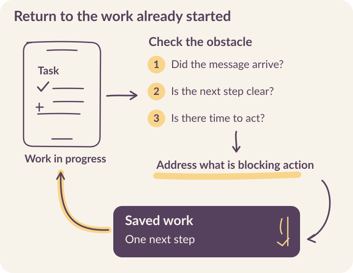

# Help learners continue after the first interaction

A learner submits a video, waits for feedback, and receives no new challenge. The dashboard records inactivity.

::: {.reading-band}
**From the learner’s side, the next move belongs to Kabakoo.**
:::

Learners described this wait during Kabakoo’s April–May 2026 follow-up calls. Others had faced repeated rejection, unclear instructions, expired videos after exams, or a lost conversation after reinstalling WhatsApp. Work and family responsibilities also interrupted participation. These are different problems. Sending the same reminder to everyone leaves the most consequential differences untouched. [Follow-up record](../sources.qmd#s22).

Continuation begins with a question: **what would let this person take the next useful step?** Sometimes the answer is a clearer instruction. Sometimes it is a repaired delivery path, feedback from a person, a peer introduction, or permission to return later.

```{=html}
<figure class="v5-process-figure"><picture><source media="(max-width: 520px)" srcset="../assets/figures/v5-continuation-mobile.svg" width="360" height="698"></picture></figure>
```

## Find the obstacle behind the silence

Elia Gandolfi’s engagement analysis shows the importance of looking beyond people who remain active. Of 826 enrolled learners, 412 never took a qualifying action. Among the other 414, recorded activity fell from 84% in week zero to 29% in week one. **The denominator is the 414 who acted at least once**; these percentages do not describe the whole enrolled cohort. [Gandolfi’s analysis](../sources.qmd#s16).

Those counts locate a problem. Follow-up helps explain it. Some learners told callers they thought training had not started because their introduction video had not been validated. Others had tried the task but did not understand what to change. **A validation gate could therefore make a willing learner appear disengaged.**

::: {.reading-note}
These calls help explain why some learners stopped. **They cannot tell us how common each obstacle was across the cohort.** Use them to identify a problem to investigate, then check whom it affects and whether the repair helps.
:::

### Choose a situation to investigate

Start with what the system and the learner can actually establish. Each situation below leads to a different next action.

```{=html}
<div class="explorer" data-deck="continuation" aria-label="Investigate interrupted participation">
<section class="explorer-panel" data-panel="Waiting for review" id="return-review"><h3>The work arrived; the next task did not</h3><p><strong>Check:</strong> Match the submission, review status, and release rule. Ask what the learner expected after submitting.</p><p><strong>Act:</strong> Give the pending review an owner. Explain when feedback will arrive and provide an appropriate activity while the review is pending.</p><p class="takeaway">Check that the learner receives usable feedback and can continue from the saved attempt.</p></section>
<section class="explorer-panel" data-panel="Unclear feedback" id="return-feedback"><h3>The same answer keeps being rejected</h3><p><strong>Check:</strong> Read the actual feedback beside the work. Ask the learner to explain what they think needs to change.</p><p><strong>Act:</strong> Name one actionable improvement, show an example, and make clarification possible. Escalate repeated failure to a person.</p><p class="takeaway">Check the next revision against the learning criterion. Another submission alone does not establish understanding.</p></section>
<section class="explorer-panel" data-panel="Missing media" id="return-media"><h3>The learner cannot open the task</h3><p><strong>Check:</strong> Inspect the file on the learner’s device, including expiry, playback, download size, and connection conditions.</p><p><strong>Act:</strong> Repair access. Offer a smaller file or another format when it preserves the skill being assessed.</p><p class="takeaway">Check that the learner can retrieve the same task and submit a response after the repair.</p></section>
<section class="explorer-panel" data-panel="No time today" id="return-time"><h3>Exams, work, or care take priority</h3><p><strong>Check:</strong> Ask whether the learner wants to pause, choose a return time, or stop proactive contact.</p><p><strong>Act:</strong> Preserve the work and show the next small step. Agree on contact instead of assuming a preferred schedule.</p><p class="takeaway">Check whether the person can resume without repeating completed work. A requested pause is a valid choice.</p></section>
<section class="explorer-panel" data-panel="Alone with a question" id="return-peer"><h3>The learner needs someone to ask</h3><p><strong>Check:</strong> Identify the concrete question, preferred language, and whether the learner wants peer or staff help.</p><p><strong>Act:</strong> Find an available person with relevant experience and obtain agreement from both people before connecting them.</p><p class="takeaway">Check whether the help was useful. An introduction is the beginning of the support exchange.</p></section>
<section class="explorer-panel" data-panel="Stop contact" id="return-stop"><h3>The person declines further reminders</h3><p><strong>Check:</strong> Clarify the requested scope: reminders, participation, or a data-related request. Do not make the person repeatedly justify the choice.</p><p><strong>Act:</strong> Apply it to queued work as well as future scheduling. Explain how to return if they choose to.</p><p class="takeaway">Check that a delayed worker cannot send a reminder after the preference has changed.</p></section>
</div>
```

## Make the route back part of the product

One learner told Kabakoo she had left because her introduction video was rejected. An evaluation limited to people who stayed would miss that experience. The team also needs to examine what happened immediately before someone stopped, including whether the system left them a usable next step. [The AI worked. Did it work for the learner?](https://kabakoo.substack.com/p/the-ai-worked-did-it-work-for-the).

A return message should orient the learner to their own work: the task they were attempting, what arrived successfully, what remains unresolved, and **one action they can take now**. A long list of everything they missed can make returning harder.

```{=html}
<div class="screen-and-note return-screen"><figure><figcaption>A challenge needs a route back to unfinished work.</figcaption></figure><div><h3>Keep the task within reach</h3><p>When reopening this conversation, can the learner find the task, its feedback, and the response format? Can they tell whether Kabakoo is waiting for them or they are waiting for Kabakoo?</p><p>Try returning after a week away. Repeat the exercise after a failed media download and after a submission awaiting review.</p></div></div>
```

<mark class="reading-mark">Preserve task state outside the chat history.</mark> A learner who loses a thread should not lose their learning record. Store the current task version, latest submission, feedback version, and unresolved support request. A return link or menu action should reconstruct the next step from that state.

The record also needs an explanation a person can understand. “Awaiting validation” may be meaningful to a developer but leave a learner uncertain. Explain what is being reviewed, who will respond, and what they can do while waiting. Set a review expectation that the team can operate, and **make overdue reviews visible to the person responsible**.

## Separate learning state from contact state

A single `inactive` flag cannot represent an unfinished task, a paused learner, an unanswered support request, and an undelivered message. These conditions need different behavior.

| Record | What it should preserve | Why it matters on return |
|---|---|---|
| Learning task | Task and submission versions; review status; next valid action | Prevents a restart or assessment of the wrong attempt. |
| Contact preference | Whether proactive contact is allowed; requested pause or return time | Prevents reminders during a requested pause. |
| Delivery attempt | Provider reference, send time, receipt, and unresolved status | Distinguishes an unavailable task from an unanswered one. |
| Support request | Question, owner, status, and next check time | Keeps a learner’s question from disappearing between teams. |

Use the delivery architecture in [Chapter 5](05-architecture.qmd) to enforce those distinctions. Before sending queued contact, **re-read the learner’s current preferences and task state**. A reminder prepared yesterday can be irrelevant today because the task was completed, a pause was requested, or a review is still pending.

Make the check and state transition safe against concurrent workers. Record a unique action key so duplicate jobs cannot create multiple support requests. Keep provider status separate from the business transition: an accepted send request does not establish receipt, and a receipt does not complete a task.

## Give support an escalation path

In September 2026, Kabakoo was developing a Learner Success system that connects direct reminders, help from a peer who has completed the task, and escalation to a Community Curator. Its effect on continuation remains to be tested. [Learner Success and peer support](../sources.qmd#s25).

Give every support request an owner. Define what triggers help, who can respond, how long a request may wait, and what happens if that person is unavailable. A learner should still have a route to attempt the task when they decline peer help. The next chapter works through the agreement and connection states.

<mark class="reading-mark">Support capacity should shape the promise.</mark> If one curator is handling several unresolved questions, a queue that records age and owner can make the limit visible. A generic instruction to “contact the team” cannot tell anyone whether the request was received or who should act.

## Measure a return that leads somewhere

The Agency Fund’s four levels help separate a successful reminder from successful learning. At **Product** level, examine whether the learner can reopen the task and obtain feedback. At **User** level, examine the attempt or revision and whether they can apply what they learned. **Impact** requires further evidence about livelihoods. Model quality matters to feedback, but cannot explain all these transitions. [Four-level framework](https://eval.playbook.org.ai/).

**Report the full eligible population alongside people reached and people who returned.** Include people whose status remains unknown. A rise in replies can reflect easier messaging while task completion remains unchanged; a lower reminder count can reflect respected pauses. Interpret each event in relation to the decision it is meant to inform.

::: {.reading-rule}
Choose one recurring interruption with your team. Connect its event record to a learner conversation, make the repair, and check the next task transition. [Plan the continuation route in your working notes](../resources.qmd#continuation).

:::