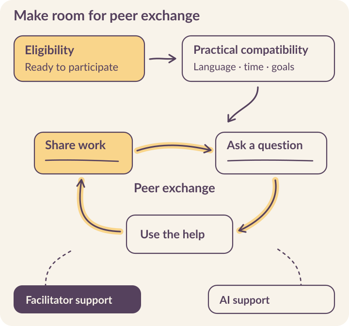

# Build relationships that support learning

An algorithm can assign people to a group. The group still needs a reason to meet, a first exchange, and something useful to do together.

Kabakoo’s pod work makes that gap visible. Earlier designs placed matching after roughly two weeks of individual challenges. By June 2026, the team was moving peer contact earlier because learners could spend that period without a social connection to the program. Earlier access created an opportunity for support; it did not make relationships happen automatically. [Pod design and timing](../sources.qmd#s24).

::: {.reading-band}
**Start with the exchange you want to make possible.**
:::

A peer might explain a confusing instruction, review a service description, share how they approached a task, or introduce someone with relevant experience. The system’s job is to make that contribution easier to ask for, offer, and use.

```{=html}
<figure class="v5-process-figure"><picture><source media="(max-width: 520px)" srcset="../assets/figures/v5-peer-exchange-mobile.svg" width="360" height="813"></picture></figure>
```

## Begin with a contribution someone values

::: {.learner-story}
{fig-alt="Fatoumata D., Kabakoo alumna and UX/UI designer."}

Fatoumata D. discovered UX/UI design through Kabakoo and later helped other learners. She gained confidence and a skill she could share with someone else. In the Digital Makers cohort, learning UX/UI design became a way to support other people’s progress. [Fatoumata’s story](../field-notes.qmd#fatoumata).

**What can someone contribute before they feel like an expert?** Understanding one instruction or completing one task may be enough to help a peer facing that same obstacle.
:::

**Make the request specific.** “Introduce yourself to the group” asks for participation without necessarily creating a reason to return. “Share the sentence you are trying to improve, and ask a peer which part is unclear” connects an introduction to work. The facilitator can help people make the first exchange without taking over every response.

## Read a quiet group carefully

Kabakoo followed **five pods from July 20 through August 23, 2026**. During August 3–9, when facilitators paused their prompts to restart conversation, no reactions were recorded in those groups. Later, facilitators tried direct messages, calls, and voice messages in Bamanankan. Responses varied across groups. [Pod observation report](../sources.qmd#s23).

::: {.reading-note}
Facilitator actions and language choices were not randomly assigned, so this observation cannot isolate their effects. **Track group creation, first reply, repeated exchange, and useful help separately.**
:::

Some groups also faced technical obstacles to starting a shared project. If a project proposal or first objective is missing, a lack of collaboration may partly reflect the system’s failure to give the group something to do. **Investigate the available task before assigning the explanation to motivation.**

Treat facilitator independence as one possible operating characteristic. It is not the purpose of the pod. A group that uses occasional support to help people complete meaningful work may be more valuable than a lively conversation with no connection to their goals.

## Follow the matching pipeline

Kabakoo’s December 2025 matching architecture combines **Django and PostgreSQL**, **APScheduler**, HAKILI embeddings, and **OR-Tools CP-SAT** or a greedy solver. It separates four jobs: **profile preparation, candidate scoring, group selection, and invitations**. [Matching architecture](../sources.qmd#s24).

| Stage | Matching mechanism | Decision to examine |
|---|---|---|
| Profile preparation | Extract interests, skills, and goals into a taxonomy. | Does an exercise answer describe the person or only the scenario they were assigned? |
| Feature snapshot | HAKILI generates 256-dimensional `text-embedding-3-small` vectors stored in `ProfileFeatureSnapshot`. | Which inputs and extraction versions produced this snapshot? |
| Pair scoring | Combine semantic similarity, geographic distance, and travel-time terms, with optional attributes. | Does the score reflect a practical opportunity to learn together? |
| Candidate groups | Build strong neighbor links, close triangles, and grow groups of three to five. | Who is left without a viable candidate? |
| Selection | Select groups with CP-SAT or greedy packing; each learner appears in at most one selected group. | How are unassigned learners and changing availability handled? |
| Invitations | Create `Pod` and `PodMembership` records; retain a `Matching` run record. | Do invited people understand the proposal and want to join? |

The pair score adds weighted components. Semantic similarity is a normalized cosine score. Geographic proximity uses a decaying function of Haversine distance; the travel term uses travel time or a distance-based proxy. **A proxy for travel is not a measure of someone’s available time.** The group objective sums pair scores, then selects compatible groups under the membership constraint.

That objective makes some choices visible and leaves others unresolved. Summing all pair scores can favor groups with more pairs. Similar interests can help people find common ground, while complementary skills may support a different learning objective. Use a demographic feature only with a clear purpose, and examine whom it includes or excludes.

### Try changing the priorities

These three candidate groups have invented feature scores so you can examine the tradeoff. All groups have the same size. The calculation below is a weighted average of shared interests and practical proximity; it is **a simplified exercise**, not Kabakoo’s production matcher or a prediction of participation.

```{=html}
<div class="matching-lab" id="matching-lab">
<div class="matching-controls" hidden><label for="match-weight">Weight given to shared interests: <output id="match-weight-value" for="match-weight">50%</output></label><input type="range" id="match-weight" min="0" max="100" step="10" value="50"><p>The remaining weight goes to proximity. Use the arrow keys to adjust the balance.</p></div>
<table><caption>Example scores: 0–100<br>Interests / proximity weights: <span id="match-caption">50 / 50</span></caption><thead><tr><th scope="col">Criterion</th><th scope="col">A</th><th scope="col">B</th><th scope="col">C</th></tr></thead><tbody><tr><th scope="row">Interests</th><td>90</td><td>65</td><td>35</td></tr><tr><th scope="row">Proximity</th><td>30</td><td>70</td><td>95</td></tr><tr><th scope="row">Combined</th><td data-candidate="A" data-interest="90" data-proximity="30"><span data-score>60</span></td><td data-candidate="B" data-interest="65" data-proximity="70"><span data-score>67.5</span></td><td data-candidate="C" data-interest="35" data-proximity="95"><span data-score>65</span></td></tr></tbody></table>
<p class="takeaway" id="match-result" role="status">Group B has the highest combined score at equal weights. Willingness, schedules, and a useful shared task still need to be established.</p>
</div>
```

<mark class="reading-mark">A useful matching review includes people who were never scored.</mark> In a June test, missing feature snapshots excluded several learners from matching. Treating those exclusions as poor compatibility would hide a data preparation failure. Track readiness separately from the score, with a repair route for missing information. [Matching and readiness records](../sources.qmd#s24).

In this architecture, `POST /matching/pods/run` initiates selection. Preserve the input snapshot, parameters, and selected membership records together. Use database constraints to prevent duplicate membership and coordinate concurrent runs. **A matching result should remain explainable** after the profile or scoring model changes.

## Obtain agreement before connecting people

**A group invitation and a request for individual help are different commitments.** Kabakoo’s planned peer-support flow asks someone who has completed the task whether they can help, then asks the learner whether they want that connection. [Peer-support design](../sources.qmd#s25).

Try the choices below. The sequence keeps a route to the task when help is declined and gives unresolved requests a staff owner.

```{=html}
<div class="support-lab" id="support-lab">
<div class="support-interaction" hidden><p class="eyebrow">A LEARNER ASKS FOR HELP WITH A TASK</p><div id="support-state" role="status" aria-live="polite"></div><div id="support-actions" class="workpad-actions"></div><button type="button" id="support-reset">Start again</button></div>
<div class="support-fallback"><ol><li>Ask an eligible peer whether they are available to help.</li><li>If the peer agrees, ask the learner whether they want the connection. Share contact details only after both agree.</li><li>If either person declines, preserve the learner’s next attempt. Offer another support route when requested.</li><li>If no peer responds within the agreed window, send the unresolved request to the curator.</li><li>After the exchange, ask the learner whether the help was useful. Record that answer separately from subsequent task completion.</li></ol></div>
</div>
```

Give each request a stable identifier and record transitions explicitly: requested, helper accepted, learner accepted, connected, confirmed, declined, or expired. **A timeout job should recheck the latest state before escalating.** Otherwise a late worker can send a curator an alert for a request that has already been resolved.

**Keep explicit confirmation of useful help separate from an inference based on a passed quiz.** Passing later may be encouraging, but it does not tell you whether a particular exchange helped. Kabakoo’s planned flow uses both signals. Store them in separate fields so an inferred success cannot overwrite what the learner actually said.

## Give the group a first piece of work

```{=html}
<div class="screen-and-note return-screen"><figure><figcaption>The invitation opens the door. A shared task gives people a reason to return.</figcaption></figure><div><h3>From invitation to exchange</h3><p>Check who accepted, who could enter, and who knows what to do first. Then look for a question addressed to a peer and a response the learner can use.</p><p>If the group is quiet, inspect the task, the invitation, and the facilitator’s availability before changing the matching weights.</p></div></div>
```

The AI Mentor can help explain an instruction or make work easier to discuss. It should also recognize when a question is addressed to another learner and <mark class="reading-mark">leave room for that person to answer</mark>. A fluent response that interrupts every exchange can work against the relationship the program is trying to develop.

Chapter 5 covers group transport and provider constraints. Keep those engineering states visible here: **selected, invited, joined, and able to exchange messages are distinct conditions**. A membership row cannot establish that someone actually entered a functioning group.

Use the Agency Fund’s **Product** level to assess whether the exchange works, and its **User** level to examine what people can do with the help. Also investigate the relationship itself: who becomes able to contribute, receive support, or pursue an opportunity with someone else? [Evaluation essay](../sources.qmd#s18).

::: {.reading-rule}
Choose one exchange to support and one way to learn whether it mattered. Then work backward to the invitation, matching rule, facilitator action, and event record required. [Develop the peer-learning plan](../resources.qmd#peers).

:::