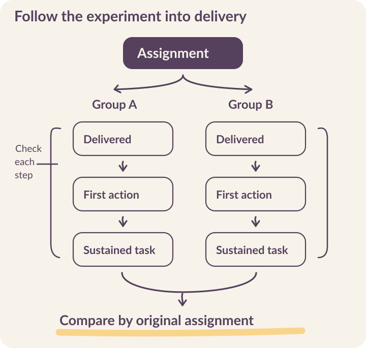

# Improve the system through experiments

**A change can increase replies while leaving learning unchanged.** An experiment can appear to compare video with text when some phones never play the video. A promising percentage can become smaller—or answer a different question—when its denominator changes.

At Kabakoo, testing reminders, tutorial videos, and mentor designs has required work on the delivery system as well as the analysis. A comparison becomes useful when the team knows what people received, what changed, and which decision the result supports.

## Choose the decision before the metric

**Start with a decision the team can act on**: which channel to use for a reminder, how to explain a first task, whether a peer introduction helps someone continue, or when to involve a facilitator. Write the expected mechanism and a plausible alternative explanation.

Place the intended outcome within The Agency Fund’s **Model, Product, User, and Impact** framework. Playback and response are product questions. Applying feedback to improve work is a user question. Improved earnings or agency requires impact evidence. A result at one level can inform another without establishing it. [Four-level framework](https://eval.playbook.org.ai/).

Smaller experiments help improve the service by connecting a design decision to <mark class="reading-mark">the outcomes measured</mark>. [AI evaluation essay](../sources.qmd#s18).

```{=html}
<figure class="v5-process-figure"><picture><source media="(max-width: 520px)" srcset="../assets/figures/v5-experiment-path-mobile.svg" width="360" height="781"></picture></figure>
```

## Examine a result at the level it measures

Kabakoo’s reminder-channel experiment compared WhatsApp with app push notifications. Among **271 assigned participants**, the reported intention-to-treat effect on activation was **+15.6 percentage points**, with a 95% confidence interval of **4.8 to 26.4** and p=0.005. Activation meant **at least two app logins**. [Reminder-channel experiment](../sources.qmd#s3).

The time-spent estimate was **+33%**, with a confidence interval from **−37% to +184%** and p=0.458. That interval leaves substantial uncertainty. The result supports increased activation under the tested conditions; **it does not establish deeper learning or a reliable improvement in time spent**.

| Question | What the experiment contributes | What still needs evidence |
|---|---|---|
| Did assignment to WhatsApp increase activation? | A positive estimate for at least two app logins in this experiment. | Whether the result transfers to a different population, message, or schedule. |
| Did participants spend more time? | An uncertain estimate with a wide interval. | A more precise estimate if that question matters to the decision. |
| Did people learn more or improve their livelihoods? | The activation and time-spent estimates do not measure these outcomes. | Measures of applied capability and later outcomes. |

This matters for continuation. Choosing an effective channel can help people encounter the task. If the task is blocked by an unresolved review, more encounters may simply bring people back to the same obstacle. Pair delivery evidence with the learning-state investigation in Chapter 8.

## Change the denominator, inspect the question

A March 6–11, 2026 onboarding experiment assigned **413 people to an AI tutorial video** and **414 to a human tutorial video**. Reading was recorded for 202 people in the AI arm and 200 in the human arm. Among those readers, 29 and 22 respectively took the first key action: a message of at least ten characters within 24 hours. [Tutorial experiment](../sources.qmd#s26).

Choose a population below. Notice both the rate and the claim you can make.

```{=html}
<div class="explorer" data-deck="denominators" aria-label="Explore the tutorial experiment denominators">
<section class="explorer-panel" data-panel="All assigned" id="denominator-assigned"><h3>413 assigned to AI · 414 assigned to human</h3><p class="explorer-question">The population for an intention-to-treat comparison</p><p>Retain people in their original assigned group, whether or not they read the message. First-action outcomes remain incomplete for the full assigned population.</p><p class="takeaway">Do not turn missing outcomes into zeros. Reconcile the full assignment and outcome records before calculating the primary comparison.</p></section>
<section class="explorer-panel" data-panel="Message readers" id="denominator-readers"><h3>202 AI readers · 200 human readers</h3><div class="evidence-bars"><div><span>AI tutorial</span><strong>29 / 202 · 14.4%</strong><div class="bar-track"><span style="width:14.4%"></span></div></div><div><span>Human tutorial</span><strong>22 / 200 · 11.0%</strong><div class="bar-track"><span style="width:11%"></span></div></div></div><p>The rounded difference is 3.4 percentage points among readers. Reading is observed after assignment, so this comparison conditions on a selected group.</p><p class="takeaway">This describes behavior among readers. Estimating the effect of assignment requires outcomes for the full assigned population.</p></section>
<section class="explorer-panel" data-panel="Active messagers" id="denominator-active"><h3>73 active AI users · 66 active human users</h3><div class="evidence-bars"><div><span>AI tutorial</span><strong>29 / 73 · 39.7%</strong><div class="bar-track"><span style="width:39.7%"></span></div></div><div><span>Human tutorial</span><strong>22 / 66 · 33.3%</strong><div class="bar-track"><span style="width:33.3%"></span></div></div></div><p>Restricting the denominator again raises both percentages. This answers a question about people who became active, excluding many people the invitation was meant to reach.</p><p class="takeaway">Keep this descriptive view beside the full funnel. It cannot establish the intervention’s effect on all assigned people.</p></section>
</div>
```

Selecting only readers or active messagers excludes people the invitation failed to engage. The same issue matters when interpreting Gandolfi’s engagement analysis and Walsh’s onboarding diagnosis.

::: {.reading-band}
**Name the population before discussing a percentage.**
:::

Preserve invitations, assignments, deliveries, and actions as separate events so a later analyst can reconstruct the intended comparison. [Engagement analysis](../sources.qmd#s16) · [Onboarding diagnosis](../sources.qmd#s17).

## Test the treatment people actually receive

In the testimonial-video experiments, early completion rates changed direction across successive cohorts. Follow-up with nine people helped identify a delivery problem: some Android users could not play the video. [Testimonial experiments](../sources.qmd#s4).

::: {.reading-note}
After the media fix, completion was 2.56% for text and 2.42% for video in a subsequent comparison. **The group sizes are needed to quantify uncertainty**, and they are unavailable for these rates. The close percentages alone cannot establish that the formats work equally well.
:::

Before launch, **test every arm from a recipient’s phone**: template approval, delivery, playback, language, links, login, and the first action. Repeat the check when content encoding or provider configuration changes. Record those versions so that a repair during the experiment is visible in the analysis.

**Distinguish assignment from receipt without discarding assigned people.** The primary analysis can estimate the effect of being assigned the intervention; delivery diagnostics explain why the intervention may not have reached them as intended. If the treatment changes materially during a run, document the change and decide how the affected period will be analyzed before inspecting favorable outcomes.

## Keep assignment durable

In the tutorial experiment, Kabakoo balanced assignment as enrollment accumulated. A production randomization service must also handle retries, simultaneous requests, and delayed events. A person who refreshes or returns should receive the same assigned condition.

Link assignment, delivery, and outcome records so the same comparison can be reconstructed after a retry or repair.

| Record | Minimum useful fields | Invariant |
|---|---|---|
| Assignment | Experiment and participant IDs, arm, assigned time, assignment probability, eligibility version | One assignment per participant within the experiment. |
| Delivery | Assignment ID, content version, provider reference, send and receipt times | Retries remain linked to the original assignment. |
| Outcome event | Event ID, participant and task IDs, event type, observed and received times | Duplicate webhooks cannot create additional successes. |
| Analysis definition | Population, outcome rule, window, exclusions, missing-data rule, analysis version | Every reported rate can be reconstructed from its definition. |

Create assignment in a database transaction and enforce a unique key on `(experiment_id, participant_id)`. If requests race, return the assignment that was committed. Keep the randomization policy and, where assignment is adaptive or unequal, the actual assignment probability. <mark class="reading-mark">Do not re-randomize after a messaging failure.</mark>

**Record when an action happened and when the server received it.** Delayed synchronization can otherwise move the same learning action across a 24-hour outcome boundary. Define which timestamp governs the analysis and how uncertain or missing timestamps will be treated.

Kabakoo’s evaluation practice connects **Langfuse, Calibrate, Evidential, PostgreSQL, and dbt**. These tools serve different purposes: tracing model behavior, reviewing responses, assigning experiments, storing events, and transforming data for analysis. A shared experiment identifier can connect their records without making any one tool the complete evidence system. [Evaluation practice](../sources.qmd#s18).

## Account for relationships in the design

An individual invitation can often be assigned at the person level. A facilitator working inside a pod may affect everyone in that group. If peers share the intervention across arms, an individual comparison may estimate a different effect from the one the team intended.

**Choose the assignment unit to fit the mechanism.** For a pod intervention, consider assignment at the group level and an analysis that accounts for clustering. The number of independent groups matters; hundreds of messages inside a few pods do not create hundreds of independent observations.

Before launching, specify **the primary outcome, minimum effect worth acting on, expected sample, measurement window, and stopping rule**. Discuss feasibility with the team delivering the intervention. A comparison that needs more groups than the program can support will not become informative merely by running longer without a plan.

Kabakoo’s personalized goal-framing experiment illustrates the constraint. Its intended outcome was completion of the 30-day Challenge. By July 2026, **the sample was too small to discern an effect**. Impressions of increased activity could not answer whether the intervention improved challenge completion. [Goal-framing experiment](../sources.qmd#s27).

## End with a decision and an unresolved question

::: {.reading-rule}
Write the result in an order the next team can use: the decision tested, who was assigned, what each arm received, the primary estimate with uncertainty, delivery problems, and the action taken. **Retain null and inconclusive findings alongside encouraging ones.**
:::

A result can justify adopting a channel, repairing a broken step, running a better-powered test, or stopping an intervention that burdens learners. State what evidence would change the decision. If the work did not answer the original question, explain what prevented it and what would make a next test informative.

[Write an experiment brief in your working notes](../resources.qmd#experiments). The next chapters extend this discipline to longer-term outcomes, governance, staffing, costs, and adaptation. [See what comes next and request early access](../coming-next.qmd).
