# People, work, and screens

Maïmouna found feedback she could act on. Soumaïla repaired equipment that a pottery workshop needed. Fatoumata developed design skills and began helping other learners. Their paths through **Kabakoo’s hybrid programs** connect learning to work and relationships.

## Maïmouna: feedback, storytelling, and a business of her own {#maimouna}

::: {.learner-story}
{width=360 fig-alt="Maïmouna T., founder of Aÿroün. Photograph: Kabakoo Academies."}

Maïmouna joined Kabakoo in 2022 after university. She developed her practice in storytelling, digital marketing, and value creation, and founded **Aÿroün, a hair care brand drawing on recipes and products from the Sahel**.

In the four-week hybrid Storytelling challenge, audience research, multimedia work, peer critique, and mentoring helped her clarify what she wanted the brand to stand for. The learning community gave her both encouragement and a structure for pursuing her goals.

Kabakoo’s August 2026 AI evaluation essay also describes what she found useful in the AI Mentor: **feedback that showed her what to add or change**, and encouragement that helped her find the courage to submit videos.

::: {.reading-rule}
Make feedback usable in the next attempt. Ask what the learner changed, and what helped them feel ready to share the work. [Evaluate what feedback makes possible](chapters/06-ai-mentors.qmd).
:::

Sources: [Kabakoo’s December 2024 profile](https://kabakoo.substack.com/p/kabakoo-monthly-update-122024), [her learning experience](sources.qmd#s41), and [The AI worked. Did it work for the learner?](https://kabakoo.substack.com/p/the-ai-worked-did-it-work-for-the). Photograph: Kabakoo Academies.
:::

## Soumaïla: from phone repairs to a ceramic kiln {#soumaila}

::: {.learner-story}
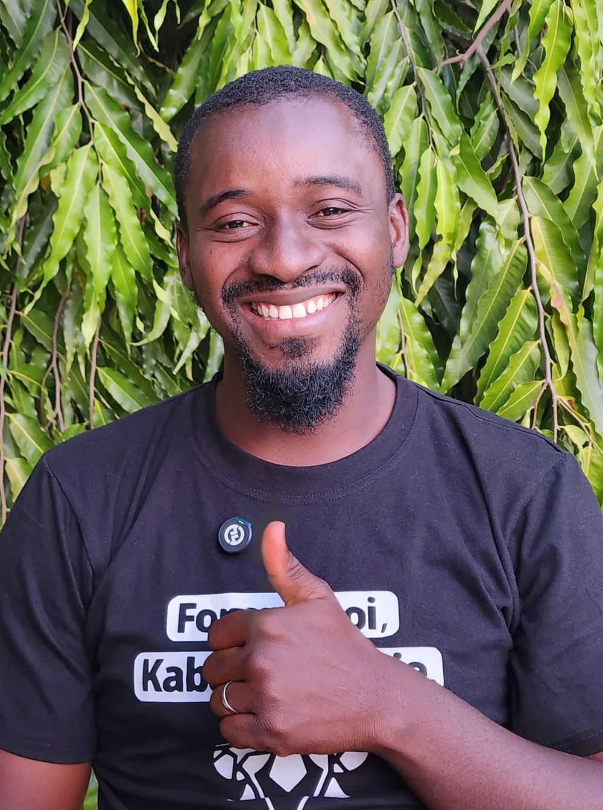{width=360 fig-alt="Soumaïla K., Kabakoo alumnus and 3D-printing expert. Photograph: Kabakoo Academies."}

Before Kabakoo, Soumaïla was studying civil engineering, **running a small phone repair business**, and helping his mother sell fish at Les Halles de Bamako. He followed Kabakoo on social media before visiting a learning space.

His first Kabakoo training was the 2019 Machine Hacking program with the Maryland Institute College of Art. Learners in Bamako and students in Baltimore worked together through Zoom.

He developed his practice in 3D printing and machine hacking, then **repaired the electronics of a Nabertherm kiln at MaliBa Poterie** after the workshop had struggled to find someone who could do the job.

> “At Kabakoo, I saw the difference right away.”

The kiln mattered because another person needed it to run a workshop. Supporting work like this means recognizing existing skills, connecting them to new practice, and making room for a practitioner’s judgment.

::: {.reading-rule}
**Begin with what a person can already do**, then follow new capability into an actual task. [Frame a problem around existing work](chapters/01-problem-framing.qmd).
:::

Source: [Kabakoo’s February 2026 update](https://kabakoo.substack.com/p/kabakoo-monthly-update-022026), “Kabakoo Faces.” Photograph: Kabakoo Academies.
:::

## Fatoumata: from discovering design to helping others learn {#fatoumata}

::: {.learner-story}
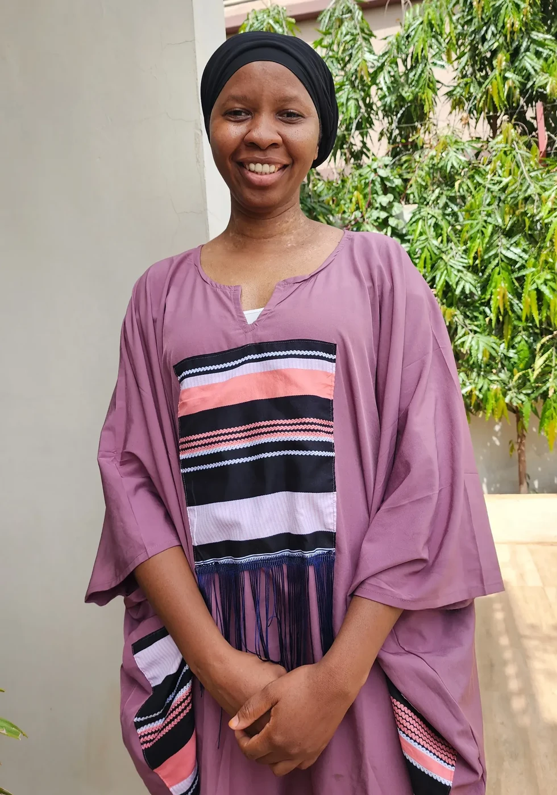{width=360 fig-alt="Fatoumata D., Kabakoo alumna and UX/UI designer. Photograph: Kabakoo Academies."}

Fatoumata D. joined Kabakoo’s Digital Makers cohort without knowing what UX/UI design was. Speaking in front of people had been stressful. She describes **gaining digital skills and confidence** through the program’s mindset work and practice.

> “Before my training at Kabakoo, I didn’t even know what UX/UI design was.”

She went on to share what she had learned with other young people and <mark class="reading-mark">mentor learners at Kabakoo</mark>. That contribution belongs in the design of a learning community: participants can become people others turn to for help.

::: {.reading-rule}
**Create opportunities to explain, demonstrate, and help a peer**. A portfolio can preserve the work; a learning relationship lets it travel. [Build peer contributions into the learning sequence](chapters/04-product-design.qmd).
:::

Source: [Kabakoo’s July 2025 update](https://kabakoo.substack.com/p/kabakoo-monthly-update-072025), “Kabakoo Faces.” Photograph: Kabakoo Academies.
:::

## Watch the work leave the phone

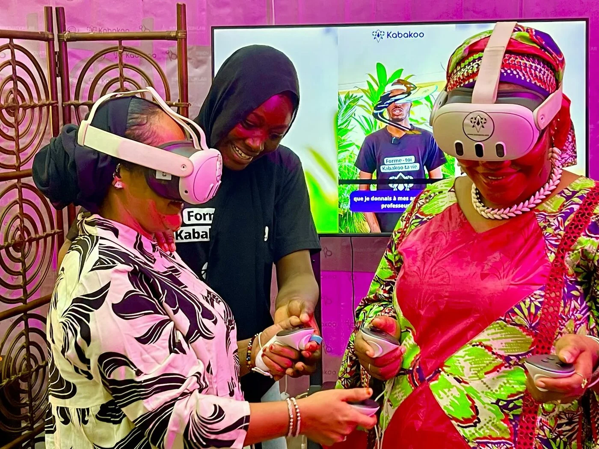{ fig-alt="Kabakoo learners demonstrating virtual reality at SENUMA in Bamako. Photograph: Kabakoo Academies."}

At SENUMA, learners demonstrated experiences and spoke with visitors. One squad member described initially struggling to approach people, then becoming able to **present experiences and conduct interviews**. The event gave her a real setting in which to practice, encounter questions, and try again. [March 2026 update](https://kabakoo.substack.com/p/kabakoo-monthly-update-032026).

## Read the interface closely {#screens}

Follow the invitation, task, and peer connection through Kabakoo’s WhatsApp interface. Select a screen, then use **Enlarge screen** to inspect the exchange.

```{=html}
<div class="explorer" data-deck="gallery" aria-label="Kabakoo screenshot gallery">
<section class="explorer-panel" data-panel="The welcome" id="gallery-1"><h3>The welcome</h3><div class="screen-and-note"><figure>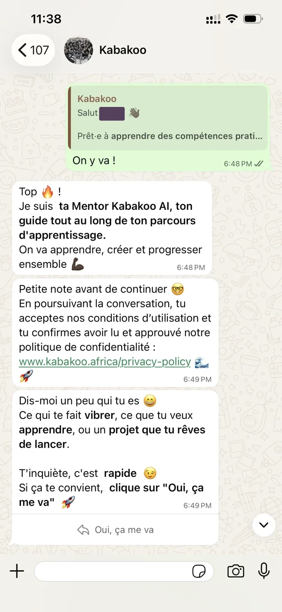</figure><div><p class="eyebrow">WHAT THE SCREEN ASKS</p><h4>The sender and the offer</h4><p>Who is speaking? What help should the learner expect? Does the introduction leave a clear first action?</p></div></div></section>
<section class="explorer-panel" data-panel="Motivation" id="gallery-2"><h3>Motivation</h3><div class="screen-and-note"><figure>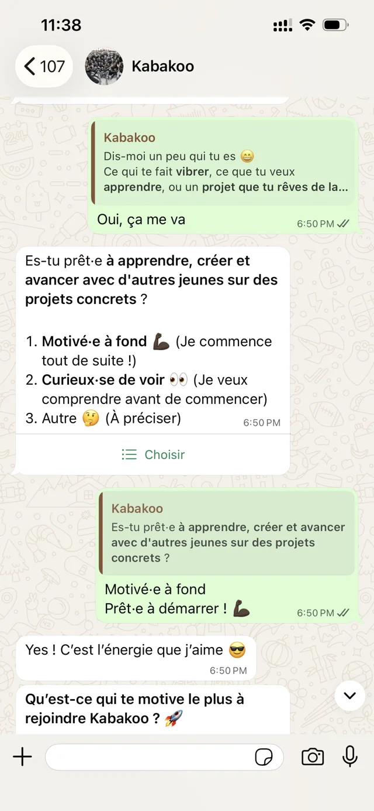</figure><div><p class="eyebrow">WHAT THE SCREEN ASKS</p><h4>The reason to begin</h4><p>Which answer changes the program? Which question could wait until after a useful first task?</p></div></div></section>
<section class="explorer-panel" data-panel="Goals" id="gallery-3"><h3>Goals</h3><div class="screen-and-note"><figure>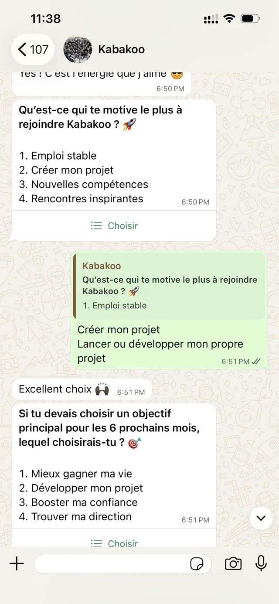</figure><div><p class="eyebrow">WHAT THE SCREEN ASKS</p><h4>The person’s own ambition</h4><p>The menu captures a starting point. A conversation is still needed to understand why this goal matters.</p></div></div></section>
<section class="explorer-panel" data-panel="Interests" id="gallery-4"><h3>Interests</h3><div class="screen-and-note"><figure>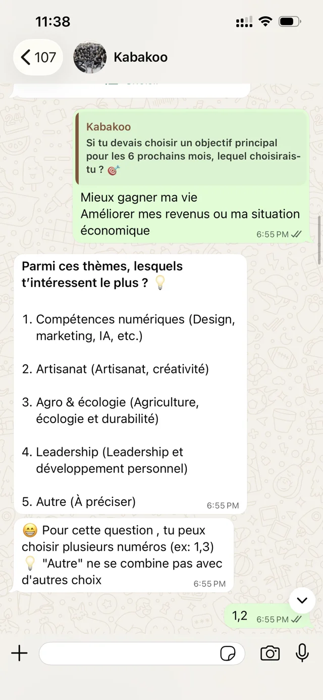</figure><div><p class="eyebrow">WHAT THE SCREEN ASKS</p><h4>A route into relevant work</h4><p>The interests list can inform a task or introduction. Check how the recorded choice actually affects the next step.</p></div></div></section>
<section class="explorer-panel" data-panel="Connection" id="gallery-5"><h3>Connection</h3><div class="screen-and-note"><figure>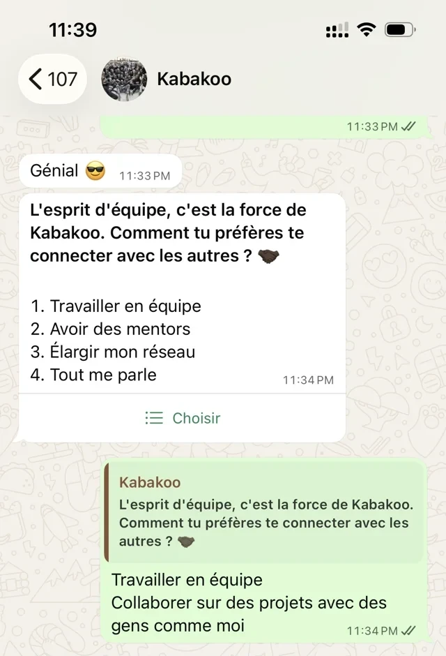</figure><div><p class="eyebrow">WHAT THE SCREEN ASKS</p><h4>An opening for relationships</h4><p>A preference for connection needs a real person, a purpose, and a workable way to meet.</p></div></div></section>
<section class="explorer-panel" data-panel="The menu" id="gallery-6"><h3>The menu</h3><div class="screen-and-note"><figure>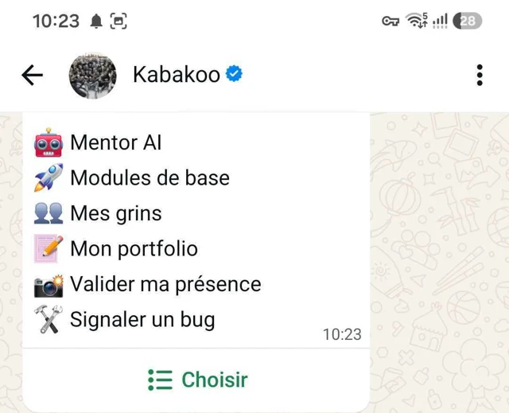</figure><div><p class="eyebrow">WHAT THE SCREEN ASKS</p><h4>A route back to the work</h4><p>Can someone returning after a few days find the task they were doing?</p></div></div></section>
<section class="explorer-panel" data-panel="The challenge" id="gallery-7"><h3>The challenge</h3><div class="screen-and-note"><figure>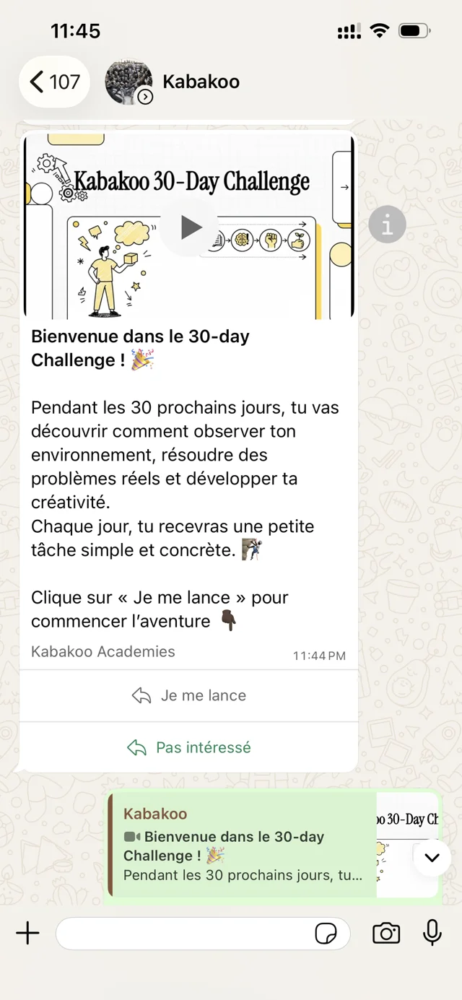</figure><div><p class="eyebrow">WHAT THE SCREEN ASKS</p><h4>A rhythm of action</h4><p>Ask the learner to explain the next task. A program overview is useful only if it leads into something doable.</p></div></div></section>
<section class="explorer-panel" data-panel="A module" id="gallery-8"><h3>A module</h3><div class="screen-and-note"><figure>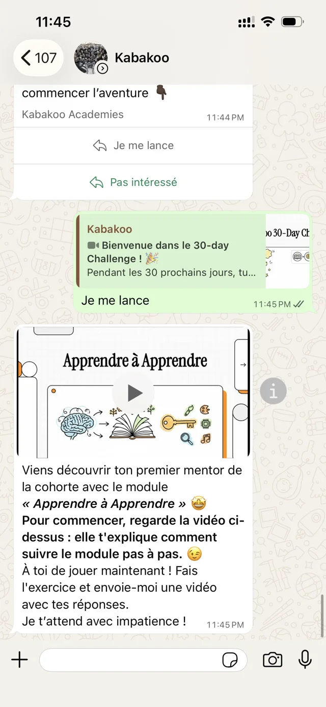</figure><div><p class="eyebrow">WHAT THE SCREEN ASKS</p><h4>From content to an attempt</h4><p>What happens after watching? The learning design needs an attempt, feedback, and an opportunity to revise.</p></div></div></section>
<section class="explorer-panel" data-panel="The pod" id="gallery-9"><h3>The pod</h3><div class="screen-and-note"><figure>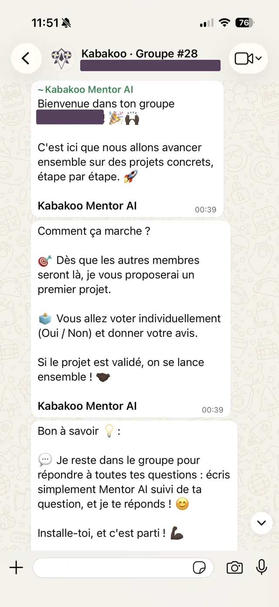</figure><div><p class="eyebrow">WHAT THE SCREEN ASKS</p><h4>The AI’s place in a group</h4><p>When should the mentor answer, and when should it leave space for peers? Observe the conversation after it intervenes.</p></div></div></section>
</div>
```

[Use these screens in a research session](chapters/03-readiness.qmd) · [Work through the architecture](chapters/05-architecture.qmd)
