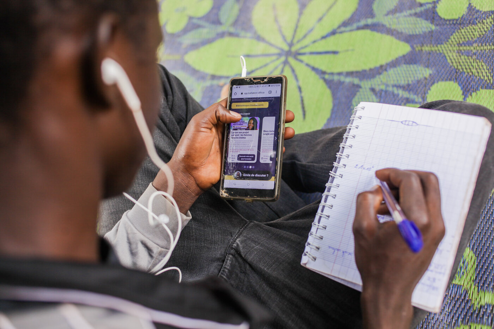
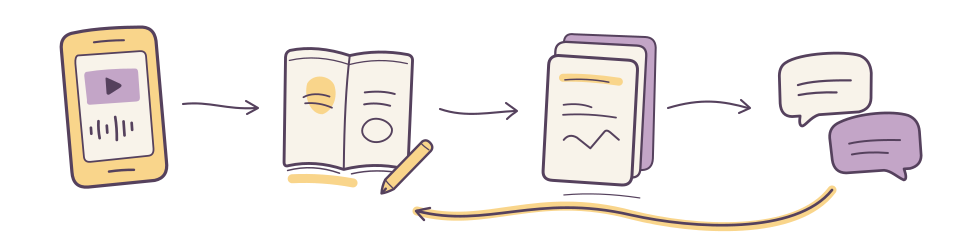

---
format:
  html:
    toc: false
---

::: {.publication-intro}
**Kabakoo Academies · September 2026**

An AI response is a beginning. What can someone do with it?

Follow Kabakoo’s WhatsApp Learning System from an invitation to feedback, peer support, and work beyond the course. <mark class="reading-mark">The aim is economic mobility.</mark> Use these lessons to build and test your own service.
:::

```{=html}
<div class="start-actions"><a class="action-link" href="chapters/01-problem-framing.html">Start reading <span aria-hidden="true">↗</span></a><a href="field-notes.html#screens">Explore the screens</a><a href="resources.html">Open your working notes</a></div>
<div class="hero-collage">
  <figure class="hero-photo"><figcaption>A learner with the Kabakoo app on a phone and a notebook. Photograph: Kabakoo Academies.</figcaption></figure>
  <figure class="hero-screen"><figcaption>The interface is the starting point.</figcaption></figure>
  <svg class="hero-thread" viewBox="0 0 700 110" aria-hidden="true"><path d="M610 14 C627 70 512 42 476 57 S426 112 354 95 S185 34 107 87 M107 87 L121 66 M107 87 L134 88" fill="none" stroke="#55415D" stroke-width="3" stroke-linecap="round"/></svg>
  <p class="hero-annotation">Follow the work beyond the screen.</p>
</div>
<p id="resume-reading" hidden></p>
```

## Meet the system behind the lessons {#orientation}

A daily task on WhatsApp. Feedback to work with. People to turn to. Kabakoo connects these parts around **learning that can travel into someone’s working life**.

```{=html}
<div class="orientation-snapshot" aria-label="Participation reported for January through June 2026">
  <p><strong>6,671</strong><span>learners engaging through WhatsApp<br>January–June 2026</span></p>
  <p><strong>826</strong><span>learners enrolled in the first Tremplin cohort<br>Launched March 2026</span></p>
</div>
<div class="explorer orientation-explorer" data-deck="orientation" aria-label="Meet Kabakoo’s learning system">
<section class="explorer-panel" data-panel="The experience" id="orientation-experience">
  <h3>One task opens the next conversation</h3>
  <p>Tremplin begins with a <strong>30-day WhatsApp challenge</strong>: one short task each day, with the AI Mentor answering questions and reviewing work. The wider learning experience combines WhatsApp with app-based courses and portfolios, peer exchanges, and in-person sessions.</p>
  <picture class="orientation-drawing"><source media="(max-width: 520px)" srcset="assets/figures/v6-orientation-mobile.svg"></picture>
  <div class="orientation-sequence" aria-label="Parts of the learning experience"><span>A task on a phone</span><span>An attempt and revision</span><span>Work to return to</span><span>An exchange</span></div>
  <p class="orientation-footnote">Facilitators and mentors support the work in Kabakoo’s learning community. Peer Pods are being tested as a route into sustained collaboration. <a href="sources.html#s40">The 2026 service</a> · <a href="chapters/04-product-design.html">Follow the learning sequence ↗</a></p>
</section>
<section class="explorer-panel" data-panel="Learning in practice" id="orientation-practice">
  <h3>Feedback becomes something a person can use</h3>
  <div class="orientation-stories">
    <article><div><p class="eyebrow">MAÏMOUNA · STORYTELLING</p><h4>The confidence to submit</h4><p>Maïmouna describes AI feedback that showed her <strong>what to add or change</strong> and helped her submit videos. Her wider Kabakoo journey includes storytelling and digital marketing for her hair care brand, Aÿroün.</p><a href="field-notes.html#maimouna">Follow her learning journey ↗</a></div></article>
    <article><div><p class="eyebrow">SOUMAÏLA · MAKING AND REPAIR</p><h4>A workshop could use the kiln again</h4><p>Soumaïla brought phone-repair experience into Kabakoo’s hybrid programs. New machine-hacking skills helped him <strong>repair the electronics of a pottery kiln</strong> that another business needed.</p><a href="field-notes.html#soumaila">Follow the work into the workshop ↗</a></div></article>
  </div>
  <p class="orientation-photo-credit">Photographs: Kabakoo Academies.</p>
  <details class="orientation-followup"><summary>What does longer-term follow-up show?</summary><p>In Kabakoo’s broader hybrid programs, the 32-month follow-up found a stronger income profile among participants: <strong>11% reported earning above 250,000 FCFA per month, compared with 7% in the comparison group</strong>. The share in the lowest bracket was also smaller, and participants reported more investment in their working lives.</p><p>These findings concern the earlier hybrid programs. The 2026 WhatsApp cohort has its own learning and follow-up journey. <a href="sources.html#s42">Read the study context</a> · <a href="coming-next.html">What we will explore next ↗</a></p></details>
</section>
<section class="explorer-panel" data-panel="What research changed" id="orientation-research">
  <h3>Listen, change the service, test again</h3>
  <div class="orientation-decisions">
    <article><span class="orientation-step">01</span><div><h4>Meet learners on WhatsApp</h4><p>The 2024 Mali youth trust survey put WhatsApp first among institutional contact channels: <strong>21.5% of 1,079 respondents</strong>. It prompted Kabakoo’s turn toward WhatsApp. <a href="chapters/01-problem-framing.html#choose-a-channel-for-a-task">Explore the survey ↗</a></p></div></article>
    <article><span class="orientation-step">02</span><div><h4>Make the first step easier</h4><p><strong>Jamie Walsh’s onboarding analysis</strong> directs attention to the invitation, sender, timing, and first action. Those are design decisions a team can test before adding more content. <a href="chapters/07-onboarding.html">Examine first use ↗</a></p></div></article>
    <article><span class="orientation-step">03</span><div><h4>Bring people into the learning loop</h4><p><strong>Elia Gandolfi’s analysis</strong> associates in-person participation with more WhatsApp activity. That makes earlier human contact a useful next experiment. <a href="chapters/08-continuation.html">Investigate continuation ↗</a></p></div></article>
  </div>
</section>
</div>
```

## Years of learning by building

This playbook draws on <mark class="reading-mark">more than six years of building and learning with AI</mark> at Kabakoo. In **April 2020**, members of our community were already working on image labeling and building AI solutions together. That December, our UNESCO workshop with Abeba Birhane and André Uhl examined how AI carries the values and assumptions of those who build it. We launched the first text version of our AI Mentor in **March 2023** and introduced Bamanankan voice interaction in **March 2024**. Those experiences sit behind the WhatsApp learning system described here.

The **World Economic Forum** named Kabakoo among [16 “Schools of the Future” in 2020](https://www.weforum.org/press/2020/01/from-wall-less-design-to-robotics-training-meet-the-16-schools-defining-the-future-of-education/). In 2024, it featured Kabakoo among [nine case studies in *Shaping the Future of Learning: The Role of AI in Education 4.0*](https://www.weforum.org/press/2024/04/revolutionizing-classrooms-how-ai-is-reshaping-global-education/), highlighting our use of AI mentoring to support young people’s learning and livelihoods.

This playbook shares the <mark class="reading-mark">knowledge accumulated through that work</mark>, including the decisions we revised and the questions we are still investigating.

## Find the decision you are facing

Read in order, or choose the decision your team needs to make next.

```{=html}
<div class="route-picker" aria-label="Choose a reading route">
<button type="button" data-route="all" aria-pressed="true">The whole playbook</button>
<button type="button" data-route="purpose" aria-pressed="false">Frame the intervention</button>
<button type="button" data-route="build" aria-pressed="false">Build the system</button>
<button type="button" data-route="evaluate" aria-pressed="false">Test and improve</button>
</div>
<p class="route-summary" role="status">Ten connected decisions, from purpose to continued learning.</p>
<div class="chapter-grid">
<a class="chapter-card" data-routes="purpose" href="chapters/01-problem-framing.html"><span class="card-number">01 / PURPOSE</span><h3>Start with the work people already do</h3><p>See the knowledge already present. Find one obstacle your application could address.</p><span class="card-end">Frame the problem ↗</span></a>
<a class="chapter-card" data-routes="purpose evaluate" href="chapters/02-theory-of-change.html"><span class="card-number">02 / CHANGE</span><h3>Connect a feature to a livelihood</h3><p>Follow the actions and relationships between a useful response and a better life.</p><span class="card-end">Explore the four evaluation levels ↗</span></a>
<a class="chapter-card" data-routes="purpose evaluate" href="chapters/03-readiness.html"><span class="card-number">03 / RESEARCH</span><h3>Find out whether people can use it</h3><p>Test on a real device, observe the pauses, and decide what the next pilot needs.</p><span class="card-end">Prepare a research round ↗</span></a>
<a class="chapter-card" data-routes="build" href="chapters/04-product-design.html"><span class="card-number">04 / LEARNING</span><h3>Build a sequence people can complete</h3><p>Make the attempt, feedback, peer contribution, and revision work together.</p><span class="card-end">Walk through the experience ↗</span></a>
<a class="chapter-card" data-routes="build" href="chapters/05-architecture.html"><span class="card-number">05 / ARCHITECTURE</span><h3>Trace a message through the stack</h3><p>Explore n8n, Django, HAKILI, storage, delivery, and recovery when a dependency fails.</p><span class="card-end">Open the engineering walkthrough ↗</span></a>
<a class="chapter-card" data-routes="build evaluate" href="chapters/06-ai-mentors.html"><span class="card-number">06 / AI MENTOR</span><h3>Evaluate what feedback makes possible</h3><p>Review responses, trace multilingual voice, and examine what learners do next.</p><span class="card-end">Test the mentor’s job ↗</span></a>
<a class="chapter-card" data-routes="evaluate" href="chapters/07-onboarding.html"><span class="card-number">07 / FIRST USE</span><h3>Design the first useful interaction</h3><p>Use the onboarding analysis to investigate the gap before the first response.</p><span class="card-end">Explore the onboarding evidence ↗</span></a>
<a class="chapter-card" data-routes="build evaluate" href="chapters/08-continuation.html"><span class="card-number">08 / CONTINUATION</span><h3>Help learners continue after the first interaction</h3><p>Find the obstacle behind an interruption and preserve a usable route back.</p><span class="card-end">Investigate a stalled task ↗</span></a>
<a class="chapter-card" data-routes="build evaluate" href="chapters/09-peer-learning.html"><span class="card-number">09 / RELATIONSHIPS</span><h3>Build relationships that support learning</h3><p>Connect matching, agreement, and facilitation to help people can use.</p><span class="card-end">Try the matching priorities ↗</span></a>
<a class="chapter-card" data-routes="evaluate" href="chapters/10-experiments.html"><span class="card-number">10 / EXPERIMENTS</span><h3>Improve the system through experiments</h3><p>Inspect assignment, delivery, outcomes, and the decision a result supports.</p><span class="card-end">Explore the denominators ↗</span></a>
</div>
```

## Begin with a person, return to the evidence

::: {.story-preview}
{width=220 fig-alt="Soumaïla K. Photograph: Kabakoo Academies."}

### A repair became a route into new work

Soumaïla was studying civil engineering, repairing phones, and helping his mother sell fish. At Kabakoo he developed machine-hacking and 3D-printing skills, then put them to work **repairing the electronics of a ceramic kiln**. New learning extended skills he was already using to earn a living. [Read Soumaïla’s story](field-notes.qmd#soumaila).
:::

## Keep four questions in view

::: {.reading-rule}
The Agency Fund’s four-level evaluation framework gives us a shared language: **Model, Product, User, Impact**. Kabakoo’s essay, [The AI worked. Did it work for the learner?](https://kabakoo.substack.com/p/the-ai-worked-did-it-work-for-the), asks what those levels reveal—and whom they can miss. A good model response, continued participation, changed capability, and improved livelihoods **each need their own evidence**.
:::

[Explore the framework through one task](chapters/02-theory-of-change.qmd#four-levels) · [Read the sources](sources.qmd) · [About the web edition](versions.qmd)

## Coming next

How does learning contribute to economic mobility? Who governs the data, operates the service, and pays for delivery? What should change when the system moves somewhere new?

Chapters **11–15** will examine outcomes and agency, governance, team operations, costs, and adaptation. [Explore the next chapters and request early access](coming-next.qmd).
